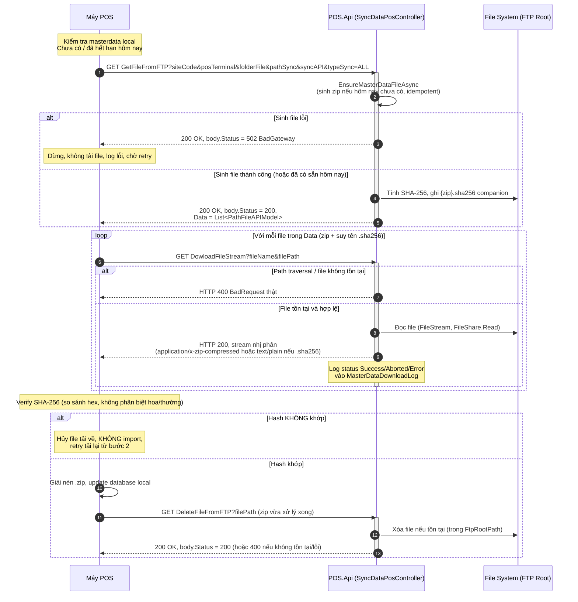

# Masterdata Sync Flow — Đồng bộ Masterdata đầu ngày cho POS

> **Đối tượng đọc**: Team DEV POS (client) tích hợp với POS.Api.
> **Phạm vi**: 3 endpoint đồng bộ file masterdata dạng `.zip` — sinh/liệt kê, tải, dọn dẹp.
> **Nguồn code**: `src/POS.Api/Controllers/SyncDataPosController.cs` (route base `api/posblue`) —
> đây là kiến trúc **MỚI** (.NET 10, Clean Architecture). **KHÔNG phải** source cũ
> `src/legacy/VCM.BLUEPOS` — đã rà soát toàn bộ `src/legacy` và xác nhận 3 endpoint dưới đây
> (và cơ chế SHA-256) không tồn tại ở đó; chúng chỉ có trong `POS.Api` hiện hành.

## 1. Tổng quan luồng nghiệp vụ

Đầu ngày, mỗi máy POS kiểm tra dữ liệu masterdata local. Nếu chưa có/đã hết hạn (sang ngày mới),
POS thực hiện tuần tự:

1. **`GET GetFileFromFTP`** — yêu cầu server sinh (nếu chưa có hôm nay) và trả danh sách file
   `.zip` masterdata cần tải.
2. **`GET DowloadFileStream`** — tải từng file trong danh sách, và tải thêm file `.sha256`
   tương ứng (POS tự suy tên, không có trong danh sách trả về ở bước 1).
3. *(Không phải HTTP API — xử lý phía POS)* Verify SHA-256 → giải nén `.zip` → update database
   local.
4. **`GET DeleteFileFromFTP`** — yêu cầu server xóa file `.zip` (và nên xóa luôn `.sha256`) vừa
   xử lý xong.

### ⚠️ Lưu ý contract quan trọng — HTTP status vs field `Status` trong body

Theo comment gốc tại `SyncDataPosController.cs:18-24`:

> Hầu hết endpoint cũ trả qua `HttpResponseData` → **HTTP status thực tế trên response LUÔN là
> 200 OK**. Trạng thái thật của nghiệp vụ (thành công/lỗi) nằm trong field `"Status"` của JSON
> body (`ResultResponse.Status`, kiểu `HttpStatusCode`), KHÔNG phải HTTP status code của response.

Ngoại lệ duy nhất: `DowloadFileStream` khi lỗi xảy ra **sớm** (trước khi bắt đầu stream — ví dụ
file không tồn tại, path traversal) mới trả **HTTP status thật là 400 BadRequest**. Khi đã bắt đầu
stream, HTTP status luôn 200 dù nội dung có bị ngắt giữa chừng hay không (client tự phát hiện qua
độ dài dữ liệu nhận được so với `Content-Length`).

Cấu trúc `ResultResponse` (`src/POS.Common/ResultResponse.cs:7-19`):

```csharp
public class ResultResponse
{
    public HttpStatusCode Status { get; set; }        // "Status" — trạng thái nghiệp vụ thật
    public string Message { get; set; }                // "Message"
    public object? Data { get; set; }                  // "Data" — omit nếu null (NullValueHandling.Ignore)
    public string MessageTechnical { get; set; }        // "MessageTechnical"
}
```

## 2. Sequence Diagram



## 3. Chi tiết API #1 — GetFileFromFTP

`GET api/posblue/GetFileFromFTP` — `SyncDataPosController.cs:64-136`

### Parameters (query string)

| Tên | Kiểu | Bắt buộc | Ghi chú |
|---|---|---|---|
| `siteCode` | `string` | **Có** (`[Required]`) | Mã cửa hàng |
| `posTerminal` | `string` | **Có** (`[Required]`) | Mã máy POS |
| `folderFile` | `string?` | Không | Thư mục con đích, ghép vào `pathSync` |
| `pathSync` | `string?` | Không | Đường dẫn sync, ghép với `folderFile` thành thư mục vật lý (`MapFtpPath`) |
| `syncAPI` | `string?` | Không | `"YES"` → nhánh Change/ChangeFirst mới gọi liệt kê file |
| `typeSync` | `string?` | Không | `"ALL"` → sinh masterdata thật (`EnsureMasterDataFileAsync`); khác `"ALL"` → nhánh `ChangeFirst`/`Change` chỉ liệt kê |

### Response

HTTP status thực tế: **luôn 200 OK**. Body `ResultResponse`:

| `Status` (body) | Khi nào |
|---|---|
| `200 OK` | Sinh/liệt kê file thành công — `Data` = danh sách file cần tải |
| `502 BadGateway` | `EnsureMasterDataFileAsync` (nhánh `typeSync == "ALL"`) throw exception — dòng 103-109 |
| `500 InternalServerError` | Exception khác ngoài dự kiến (path, IO...) — dòng 129-135 |

`Data` (khi thành công) = `List<PathFileAPIModel>` (`src/POS.Common/Dtos/FileModel/FileModelDto.cs:6-14`):

```csharp
public class PathFileAPIModel
{
    public string? FileName { get; set; }
    public string? FilePath { get; set; }
    public string? IPServer { get; set; }
    public string? PathFileIPServer { get; set; }
    public string? NetworkPathDisc { get; set; }
    public string? FolderAPI { get; set; }
}
```

> **Lưu ý**: `.sha256` companion file **KHÔNG xuất hiện** trong `Data` — chỉ liệt kê `*.zip`
> (`GetFileFromServerApiAsync` chỉ liệt kê zip). POS phải **tự suy tên** `{FileName}.sha256`
> rồi tải qua API #2.

### Ghi chú logic nội bộ (không phải hợp đồng HTTP, nhưng ảnh hưởng hành vi POS quan sát được)

- Idempotent theo ngày: nếu zip hôm nay đã tồn tại và hợp lệ, không sinh lại
  (`MasterDataSyncService.IsTodayZipValid`) — gọi lại API nhiều lần trong ngày an toàn.
- All-or-nothing: nếu bảng có `IsSingleFile=1` được tách riêng zip, tất cả zip (common + riêng
  từng bảng) trong 1 lượt phải hợp lệ hôm nay, nếu không sẽ regenerate toàn bộ lượt.

## 4. Chi tiết API #2 — DowloadFileStream

`GET api/posblue/DowloadFileStream` — `SyncDataPosController.cs:422-498`

> Tên endpoint giữ nguyên chính tả **"Dowload"** (thiếu chữ "n") — đây là contract cũ với 5.000
> máy POS, **không được sửa lỗi chính tả này**.

### Parameters (query string)

| Tên | Kiểu | Bắt buộc | Ghi chú |
|---|---|---|---|
| `fileName` | `string?` | Khuyến nghị | Dùng để đặt header `Content-Disposition`, không dùng để định vị file |
| `filePath` | `string?` | **Có** | Đường dẫn UNC dạng `\\ip\FTPBLUEPOS\...` do POS gửi (lấy từ `Data[].FilePath`/`PathFileIPServer` ở API #1) — server tự resolve về physical path (`ResolveFtpPhysicalPath`) |
| `pathDisk` | `string?` | Không dùng | Có trong signature nhưng không được sử dụng trong logic (dòng 424) |

### Response

| Tình huống | HTTP status | Nội dung |
|---|---|---|
| Path traversal (resolve ra ngoài FTP root) | **400 BadRequest** (thật) | `ResultResponse` JSON, `Message = "Đường dẫn file không hợp lệ"` |
| File không tồn tại | **400 BadRequest** (thật) | `ResultResponse` JSON, `Message = "File: {fileName} không tồn tại"` |
| Stream thành công (dù bị ngắt giữa chừng hay không) | **200 OK** | Raw byte stream — `.zip` → `Content-Type: application/x-zip-compressed`; `.sha256` → `Content-Type: text/plain` (dòng 454-456). Header `Content-Length`, `Content-Disposition: attachment; filename="{fileName}"` |
| Exception ngoài dự kiến trước khi stream | **400 BadRequest** (thật) | `ResultResponse` JSON kèm chi tiết exception |

- **Không có DTO response riêng** cho trường hợp thành công — response là stream nhị phân thô.
- Server log kết quả thực tế vào field nội bộ `status` (`Success`/`Aborted`/`Error`) và ghi vào
  bảng `dbo.MasterDataDownloadLog` (không phải field trả về cho POS) — POS **không** dựa vào log
  này, chỉ tự xác định qua độ dài byte nhận được / SHA-256.

### Cách lấy file `.sha256` — không có API riêng

Đã xác nhận trong code (comment `SyncDataPosController.cs:452-453`,
`MasterDataSyncService.cs:251-252`): file `.sha256` được sinh **cùng lúc** với `.zip`
(`PublishZipAsync`, cùng thư mục, tên = `{zipName}.sha256`), nội dung là **chuỗi text thuần**
64 ký tự hex, lowercase (SHA-256 chuẩn, tính bằng `SHA256.HashDataAsync` —
`MasterDataSyncService.cs:335-340`). POS tải nó bằng **chính API #2**, chỉ cần đổi `fileName`/
`filePath` thành `{FileName}.sha256` — không có endpoint `GetHash`/`ValidateHash` riêng.

## 5. Chi tiết API #3 — DeleteFileFromFTP

`GET api/posblue/DeleteFileFromFTP` — `SyncDataPosController.cs:367-400`

### Parameters (query string)

| Tên | Kiểu | Bắt buộc | Ghi chú |
|---|---|---|---|
| `filePath` | `string?` | **Có** | UNC path giống API #2, resolve qua cùng `ResolveFtpPhysicalPath` |

### Response

HTTP status thực tế: **luôn 200 OK**. Body `ResultResponse`:

| `Status` (body) | Khi nào |
|---|---|
| `200 OK` | Xóa thành công — `Message = "Delete file IPserver {ip} success"` |
| `400 BadRequest` | Path traversal (resolve ra ngoài FTP root) |
| `400 BadRequest` | File không tồn tại trên server — `Message = "...fail, do không tồn tại file trên FTP"` |
| `400 BadRequest` | Exception khi xóa (IO lock, permission...) |

### Ghi chú vận hành

Cơ chế xóa theo yêu cầu POS này **độc lập** với cơ chế daily-refresh tự động phía server
(`MasterDataSyncService.CleanupSiblingZips` — dòng 308-332): server tự dọn zip cũ/mồ côi mỗi khi
publish lượt zip mới, không phụ thuộc POS có gọi `DeleteFileFromFTP` hay không. Vì vậy POS **nên**
vẫn gọi API này ngay sau khi xử lý xong để giải phóng dung lượng sớm, nhưng nếu bỏ qua (mất kết
nối, crash...) hệ thống vẫn tự dọn được ở lượt sync kế tiếp.

## 6. Góc chú ý cho Dev POS (Best Practices)

### 6.1. Giải nén an toàn (Zip Slip prevention)

- Trước khi giải nén, kiểm tra từng entry trong `.zip`: đường dẫn đích sau khi resolve **phải**
  nằm trong thư mục đích dự kiến (chặn "Zip Slip" — entry chứa `../` thoát ra ngoài thư mục).
- Giải nén vào thư mục **tạm** trước, chỉ move/overwrite vào thư mục dữ liệu thật khi giải nén
  toàn bộ thành công — tránh trạng thái dữ liệu local dở dang nếu giải nén giữa chừng bị lỗi.
- Không tin tưởng `Content-Length` tuyệt đối để xác định file đã tải đủ — luôn xác nhận bằng
  bước verify SHA-256 ở mục 6.2 trước khi giải nén.

### 6.2. Verify SHA-256 — chống file rác/hỏng

Quy trình khuyến nghị (theo đúng note đã có trong `CLAUDE.md` phần "Sinh file master data .zip"):

1. Tải `.zip` qua API #2.
2. Tải `{FileName}.sha256` qua API #2 (trước hoặc sau khi tải zip đều được).
3. Tính SHA-256 của file `.zip` vừa tải bằng thư viện chuẩn (`System.Security.Cryptography.SHA256`
   trên .NET, hoặc `SHA256CryptoServiceProvider` trên .NET Framework cũ).
4. So sánh chuỗi hex (không phân biệt hoa/thường) với nội dung file `.sha256`.
5. **Khớp** → cho phép giải nén/import. **Lệch** → hủy file `.zip` vừa tải, **KHÔNG** import dữ
   liệu nghi ngờ corrupt, tải lại từ đầu.

> **Giới hạn phạm vi bảo vệ — hiểu đúng để không lạm dụng**: cơ chế SHA-256 này chỉ đảm bảo
> **integrity** (phát hiện file bị corrupt/truncate do lỗi mạng/disk khi truyền), **KHÔNG PHẢI
> authenticity** (không chứng minh đúng nguồn gốc, không chống giả mạo có chủ đích) — vì hash
> được phát cùng kênh HTTP với file zip; kẻ tấn công có khả năng chặn/sửa response thì cũng sửa
> được cả hai. Muốn chống giả mạo thật cần HMAC (khóa bí mật chia sẻ) hoặc dựa vào TLS (HTTPS) để
> đảm bảo kênh truyền không bị can thiệp.

### 6.3. Retry mechanism — Bước 2 (Download) và Bước 3 (Verify)

- **API #1 (`GetFileFromFTP`)**: idempotent theo ngày (mục 3), nên có thể retry an toàn với
  backoff (vd exponential: 1s, 2s, 4s..., giới hạn số lần thử, vd tối đa 3-5 lần) nếu nhận
  `Status = 502` hoặc `500` trong body.
- **API #2 (`DowloadFileStream`)**:
  - HTTP 400 thật (file không tồn tại/path lỗi) → **không nên retry ngay** — có thể do API #1
    chưa sinh xong hoặc tên file sai; log và quay lại API #1 trước khi thử lại API #2.
  - Stream trả 200 nhưng dữ liệu nhận về ngắn hơn `Content-Length` khai báo (kết nối rớt giữa
    chừng, tương ứng trạng thái server-side `Aborted`/`Error`) → coi như tải thất bại, retry tải
    lại file đó với backoff.
  - SHA-256 lệch (mục 6.2) → coi như tải thất bại, retry tải lại (không retry vô hạn — giới hạn
    số lần, nếu vẫn lệch thì dừng và báo lỗi vận hành, có thể do file gốc trên server bị hỏng).
- **Không xóa file masterdata local cũ** cho tới khi có file mới **đã verify hash thành công** —
  đảm bảo POS luôn có 1 bộ dữ liệu hợp lệ để vận hành ngay cả khi lượt sync mới thất bại.
- Sau khi giải nén + update DB local thành công, mới gọi API #3 (`DeleteFileFromFTP`) để dọn file
  trên server — nếu update DB thất bại, **không xóa** file server (giữ nguyên để có thể tải lại
  đúng file đó, tránh phải chờ server sinh lại).

## 7. Tổng hợp HTTP Status Code

| Endpoint | HTTP status thật | `body.Status` | Ý nghĩa |
|---|---|---|---|
| `GetFileFromFTP` | 200 | 200 | Thành công — có `Data` |
| `GetFileFromFTP` | 200 | 502 | Sinh masterdata lỗi (`EnsureMasterDataFileAsync` throw) |
| `GetFileFromFTP` | 200 | 500 | Exception ngoài dự kiến |
| `DowloadFileStream` | 200 | *(không có body JSON — raw stream)* | Đã bắt đầu stream (có thể `Aborted`/`Error` phía server log, POS tự phát hiện qua độ dài dữ liệu + SHA-256) |
| `DowloadFileStream` | **400** | JSON `ResultResponse` | Path traversal / file không tồn tại / exception trước khi stream |
| `DeleteFileFromFTP` | 200 | 200 | Xóa thành công |
| `DeleteFileFromFTP` | 200 | 400 | File không tồn tại / path traversal / exception khi xóa |

---

*Tài liệu này mô tả API hiện hành trong `src/POS.Api/Controllers/SyncDataPosController.cs`. Khi
sửa đổi endpoint liên quan, cập nhật tài liệu này cùng commit theo quy tắc "giữ doc đồng bộ với
code" của dự án (xem `CLAUDE.md`).*
