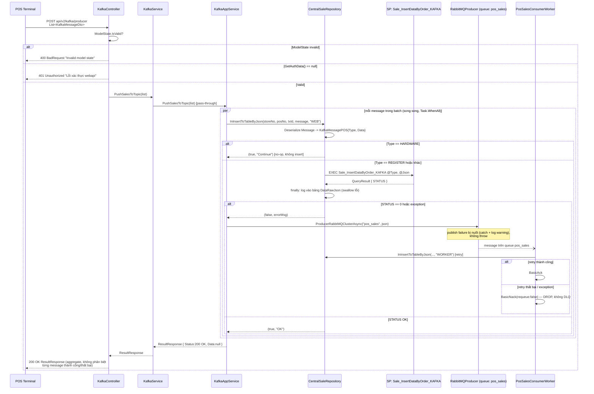

# Push Sales Flow (`api/v2/kafka/producer`)

> Reverse-documented từ source ngày 2026-07-08. Mọi path/dòng code trích dẫn đã được đọc trực
> tiếp từ file gốc để xác nhận (không suy đoán).

## 1. Tổng quan luồng dữ liệu

Endpoint `POST api/v2/kafka/producer` được máy POS gọi để đẩy dữ liệu bán hàng (sale data) lên
server theo dạng batch (`List<KafkaMessageDto>`).

**Lưu ý quan trọng nhất — tên gọi gây hiểu lầm**: mặc dù class/route/DTO đều mang tên "Kafka"
(`KafkaController`, `IKafkaService`, `KafkaMessageDto`...), luồng này **hoàn toàn không dùng
Kafka**. Cơ chế thật sự là:

1. **Ghi thẳng vào DB** (primary path) — gọi stored procedure `Sale_InsertDataByOrder_KAFKA` qua
   Dapper, đồng bộ, đợi kết quả ngay trong request.
2. **Fallback qua RabbitMQ** — chỉ khi bước (1) thất bại, publish message vào queue RabbitMQ tên
   `pos_sales` để một worker khác (`PosSalesConsumerWorker`, chạy trong `POS.Worker`) thử insert
   lại sau.

`IKafkaProducer`/Confluent.Kafka (Kafka broker thật) **có tồn tại** trong codebase
(`src/POS.Infrastructure/Messaging/KafkaProducer.cs`) nhưng được dùng bởi một pipeline khác hoàn
toàn — `SyncDataPosController` (upload file sale data) — **không** liên quan tới
`KafkaController`/`api/v2/kafka/producer`. Tài liệu `docs/CURRENT_STRUCTURE.md` (mô tả
`IKafkaService`/`IKafkaAppService` là "publish sale messages lên Kafka") hiện **không chính xác**
theo nghĩa đen — dependency injected thật sự là `IRabbitMQProducer`, không phải `IKafkaProducer`.

## 2. Sequence Diagram



## 3. Chi tiết Endpoint

### `POST api/v2/kafka/producer`

| Thuộc tính | Giá trị |
|---|---|
| Controller | `src/POS.Api/Controllers/KafkaController.cs:17-29` |
| Authentication | **Không** có `[Authorize]`. Xác thực thủ công qua `GetAuthData()` (đọc header kiểu Basic Auth từ `BaseController`) — chỉ kiểm tra `null`, kết quả decode (`AuthDto`) không được dùng tiếp sau đó |
| Content-Type | `application/json` |
| Body | `List<KafkaMessageDto>` (**batch**, không phải object đơn) |

### Request Schema — `KafkaMessageDto`

Nguồn: `src/POS.Common/Dtos/POS/KafkaMessageDto.cs`

| Field | Type | Validation | Ghi chú |
|---|---|---|---|
| `TransactionId` | `string` | *(không có)* | Không `[Required]` — dù vậy được dùng làm khoá ghi log/DB ở downstream (`DataRawJson.TransactionId`, cắt còn 30 ký tự) |
| `DataType` | `string?` | `[Required]` | |
| `Message` | `string?` | `[Required]` | Chuỗi JSON, được deserialize ở tầng Repository thành `KafkaMessagePOS { Type, Data }` (`src/POS.Common/Dtos/POS/KafkaMessagePOS.cs`) |

Ví dụ request body:

```json
[
  {
    "TransactionId": "VIN001202607080001",
    "DataType": "SALE",
    "Message": "{\"Type\":\"REGISTER\",\"Data\":{ /* order payload */ }}"
  }
]
```

### Response Schema — `ResultResponse`

Nguồn: `src/POS.Common/ResultResponse.cs`. Đây là contract chung toàn hệ thống — **4 field cố
định**, không đổi tên.

| Field | Type | Ghi chú |
|---|---|---|
| `Status` | `HttpStatusCode` (int) | Trạng thái nghiệp vụ — **không nhất thiết trùng** HTTP status code thật của response (controller luôn trả `Task<ResultResponse>`, ASP.NET Core mặc định 200 ở transport layer) |
| `Message` | `string` | Thông điệp người dùng |
| `Data` | `object?` | Luôn `null` trong flow này (kể cả khi thành công) — không có chi tiết per-message |
| `MessageTechnical` | `string` | Chi tiết kỹ thuật (vd. serialized exception khi lỗi) |

### Status/Outcome Codes

| Tình huống | HTTP transport | `ResultResponse.Status` | `Message` |
|---|---|---|---|
| ModelState không hợp lệ (thiếu `DataType`/`Message`) | 200 | `400 BadRequest` | `"Invalid model state"` |
| `GetAuthData()` trả `null` | 200 | `401 Unauthorized` | `"Lỗi xác thực webapi"` |
| Toàn bộ batch xử lý xong (kể cả khi có message fallback qua RabbitMQ) | 200 | `200 OK` | `"OK"` |
| Exception không bắt được bên trong `KafkaAppService.PushSalesToTopic` (vd lỗi kết nối DB) | 200 | `400 BadRequest` | `ex.Message`, `MessageTechnical` = serialized exception |

> **Quan trọng**: response `200 OK` ở tầng `ResultResponse.Status` **không đảm bảo** mọi message
> trong batch đã insert DB thành công — nó chỉ có nghĩa là toàn bộ `Task.WhenAll` hoàn tất không
> ném exception. Message insert thất bại (DB) nhưng publish RabbitMQ thành công vẫn được tính là
> phần của response `OK` chung, không có field nào phản ánh trạng thái riêng của từng message.

## 4. Lưu ý quan trọng

- **Không có Schema Registry** — không áp dụng, vì luồng không đi qua Kafka broker thật. Payload
  `Message` là chuỗi JSON tự do, chỉ được validate ở mức "convert thành công hay không"
  (`StringHelper.StringToObject<KafkaMessagePOS>`), không có schema cứng.
- **Định dạng JSON**: toàn bộ serialize/deserialize dùng **Newtonsoft.Json** (`JsonConvert`),
  nhất quán với quy tắc dự án — không dùng `System.Text.Json`.
- **Authentication**: không dùng `[Authorize]`/cookie/JWT chuẩn ASP.NET — dùng cơ chế header tự
  chế qua `GetAuthData()`. Chỉ kiểm tra sự tồn tại, không dùng danh tính để phân quyền tiếp.
- **Batch, xử lý song song**: mỗi phần tử trong `List<KafkaMessageDto>` được xử lý đồng thời
  (`Select(...) + Task.WhenAll`) trên **kết nối DB riêng theo store** (`storeNo` suy từ 4 ký tự
  đầu `TransactionId`) — không có thứ tự xử lý đảm bảo giữa các message trong cùng batch.
- **Tên queue `pos_sales` hardcode ở 2 nơi** — `KafkaAppService.cs:32` (producer) và
  `PosSalesConsumerWorker.cs:23` (consumer). Đổi tên queue phải sửa đồng thời cả hai, không có
  config tập trung.
- **`PushSaleDataTypeEnum.HARDWARE`** — nếu `Message.Type == "HARDWARE"`, repository trả về
  `(true, "Continue")` ngay mà **không insert** gì vào DB (no-op success) — cần biết để không hiểu
  lầm là mọi request `200 OK` đều đã ghi dữ liệu.
- **`PosSalesConsumerWorker` chỉ chạy trong `POS.Worker`**, có điều kiện (`EnableRabbitMQConsumer`)
  — không host trong `POS.Api`/`POS.Web`. Nếu `POS.Worker` không chạy hoặc consumer bị tắt, message
  fallback trong queue `pos_sales` sẽ tồn đọng không ai xử lý (nhưng cũng không mất — nằm trong
  queue durable cho tới khi có consumer).

## 5. Known Issues / Caveats

1. **Nguy cơ mất message thầm lặng**: nếu **cả** DB insert (bước 1) **và** publish RabbitMQ
   (bước 2, fallback) đều thất bại — ví dụ RabbitMQ broker down đúng lúc DB cũng lỗi —
   `RabbitMQProducer.ProducerRabbtMQClusterAsync` chỉ log `LogWarning` rồi return, **không** ném
   exception (`RabbitMQProducer.cs:125-128`), khiến `KafkaAppService` vẫn coi task đó là hoàn tất
   bình thường và trả `200 OK` chung cho cả batch. Message coi như mất, không có cách retry nào
   khác. `ReconnectBackoff` 30s (`RabbitMQProducer.cs:17`) làm tăng khả năng gặp cửa sổ lỗi kép
   này nếu broker vừa down.
2. **Log audit `DataRawJson` cũng nuốt lỗi**: `InsertDataRawJsonAsync`
   (`CentralSaleRepository.cs:347-379`) có try/catch rỗng (swallow) với comment xác nhận đây là
   chủ đích ("nếu log fail mà main processing cũng fail, PushSalesToTopic() sẽ đẩy sang RabbitMQ
   retry tự động") — nghĩa là nếu chính insert log audit lỗi, không có dấu vết nào được ghi lại
   ngoài log ứng dụng (`ILogger`), không có bản ghi DB để trace lại sau này.
3. **Response không có chi tiết per-message**: `ResultResponse.Data` luôn `null`; POS client
   nhận `200 OK`/`"OK"` chung cho toàn batch dù có message âm thầm fallback qua RabbitMQ hoặc bị
   coi là no-op (`HARDWARE`). Không có cách nào phân biệt qua response.
4. **`PosSalesConsumerWorker` không requeue khi retry thất bại** (`PosSalesConsumerWorker.cs:135`,
   `142`): `BasicNackAsync(..., requeue: false)` — message bị **drop hẳn**, không có Dead Letter
   Queue (DLQ) cấu hình. Nếu retry ở worker cũng thất bại (vd do lỗi dữ liệu chứ không phải do
   broker), dữ liệu sale đó coi như mất vĩnh viễn không còn cách nào phục hồi tự động.
5. **`authData` trong controller là dead-code validation**: `KafkaController.cs:23` gọi
   `GetAuthData()` và chỉ kiểm tra `null`, biến `authData` không được dùng ở bất kỳ đâu sau đó
   (không dùng để xác định store/quyền/log identity) — chỉ là một "có header hợp lệ hay không",
   không thực sự xác thực danh tính request.
6. **Tài liệu hiện có (`docs/CURRENT_STRUCTURE.md`) mô tả sai bản chất**: các dòng mô tả
   `IKafkaService`/`IKafkaAppService` là "Publish sale messages lên Kafka" / "Kafka producer
   wrapper" không chính xác — dependency thật sự inject là `IRabbitMQProducer`
   (`KafkaAppService.cs:13`), không phải `IKafkaProducer`. Tài liệu này (`PushSales_Flow.md`)
   không sửa `CURRENT_STRUCTURE.md` — chỉ ghi nhận sai lệch, cần cập nhật riêng nếu được yêu cầu.
7. **`docs/API_CONTRACT.md` chưa có mục nào cho endpoint này** — tài liệu này lấp khoảng trống đó,
   không phải bản đối chiếu với tài liệu cũ.
8. **Không có contract test khoá field JSON cho `KafkaMessageDto`/`ResultResponse` của endpoint
   này**: thư mục `tests/POS.ContractTests` hiện chưa tồn tại trong repo (đã xác nhận qua tìm
   kiếm) — nếu tạo lại bộ test này trong tương lai, cần bổ sung test cho endpoint
   `api/v2/kafka/producer`.

## 6. Tham chiếu file nguồn

| Layer | File | Vai trò |
|---|---|---|
| Controller | `src/POS.Api/Controllers/KafkaController.cs` | Nhận request, validate, ủy quyền cho service |
| DTO request | `src/POS.Common/Dtos/POS/KafkaMessageDto.cs` | Input schema |
| DTO nội bộ | `src/POS.Common/Dtos/POS/KafkaMessagePOS.cs` | Payload sau khi deserialize field `Message` |
| Application service | `src/POS.Application/Features/DataSync/IKafkaService.cs`, `KafkaService.cs` | Pass-through, không có logic |
| Infrastructure AppService | `src/POS.Infrastructure/AppServices/DataSync/KafkaAppService.cs` | Điều phối DB insert + fallback RabbitMQ |
| Repository | `src/POS.Infrastructure/Repositories/Sale/CentralSaleRepository.cs` (method `InInsertToTableByJson`, dòng 266-379) | Gọi SP `Sale_InsertDataByOrder_KAFKA`, ghi log `DataRawJson` |
| Messaging producer | `src/POS.Infrastructure/Messaging/RabbitMQProducer.cs` | Publish fallback vào queue `pos_sales` |
| Worker/Consumer | `src/POS.Infrastructure/Workers/PosSalesConsumerWorker.cs` | Consume queue `pos_sales`, retry insert DB |
| Response contract | `src/POS.Common/ResultResponse.cs` | Response envelope chung toàn hệ thống |
