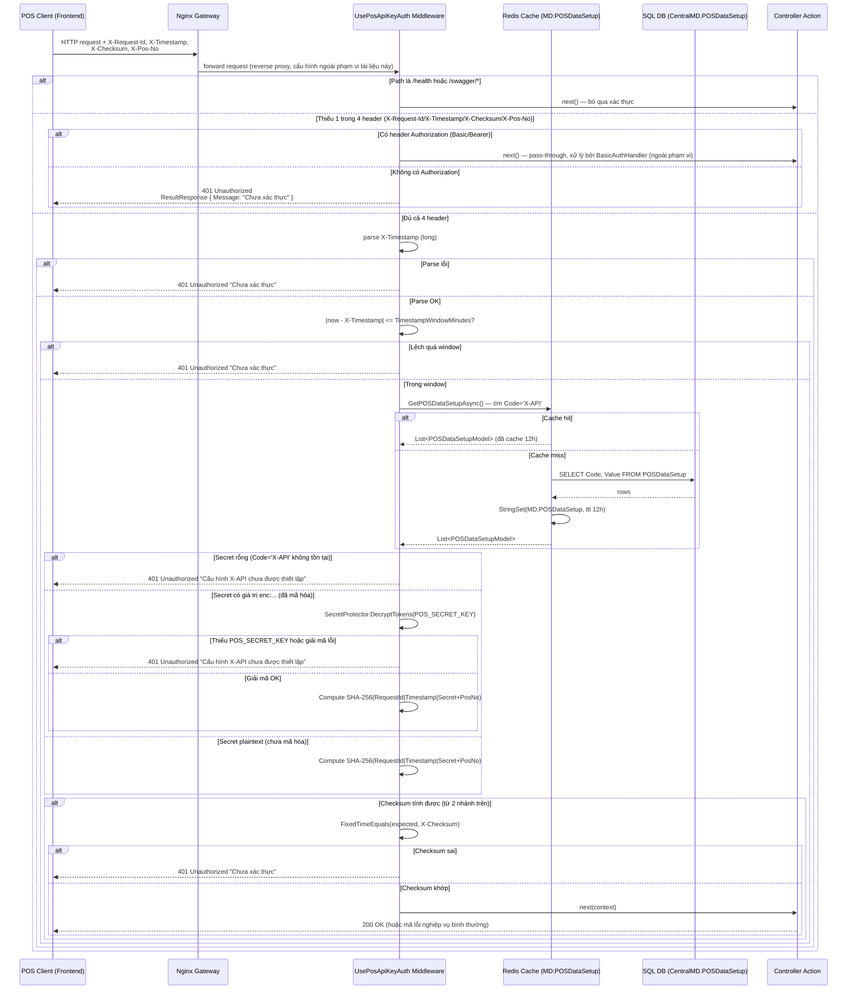

# Xác thực máy POS — `UsePosApiKeyAuth()` Flow

> Reverse-documented từ source ngày 2026-07-08. Mọi header/message/field trích dẫn trong tài liệu
> này đã được đọc trực tiếp từ `src/POS.Api/Middleware/PosApiKeyMiddleware.cs`,
> `PosApiKeyChecksum.cs`, `PosApiKeyAuthOptions.cs`, `Program.cs` và `src/POS.Common/ResultResponse.cs`
> — không suy đoán. Xem thêm bản tóm tắt trong `docs/API_CONTRACT.md` §2.1 (contract tổng hợp toàn
> bộ API) — tài liệu này viết riêng cho team Frontend/Client POS tích hợp.

## 1. Tổng quan (Overview)

`UsePosApiKeyAuth()` (`src/POS.Api/Middleware/PosApiKeyMiddleware.cs`) là middleware xác thực chạy
**trước mọi controller action**, áp dụng cho **toàn bộ route** của POS.Api, **trừ**:

- `/health` và `/swagger/*` (bypass hoàn toàn, không cần header).
- Route mà request có sẵn header `Authorization: Basic ...` hoặc `Authorization: Bearer ...` —
  đây là **cơ chế xác thực khác** (`BasicAuthHandler`, dùng cho `/api/v2/*`), pass-through không
  đổi, **ngoài phạm vi tài liệu này**.

Với mọi route còn lại (gọi trực tiếp từ máy POS, không qua `Authorization`), client **bắt buộc**
gửi kèm 4 HTTP header. Middleware xử lý theo đúng thứ tự:

1. Parse `X-Timestamp` → phải là số nguyên (Unix epoch giây). Sai định dạng → từ chối.
2. Kiểm tra `X-Timestamp` lệch so với giờ server không quá `PosApiKeyAuth:TimestampWindowMinutes`
   (mặc định **10 phút**, cấu hình trong `appsettings.json`). Lệch quá → từ chối.
3. Lấy **secret dùng chung** (`Code = 'X-API'` trong bảng `POSDataSetup`) qua
   `ICentralMDRepository.GetPOSDataSetupAsync()` — kết quả được **cache Redis 12 giờ**
   (`MD:POSDataSetup`), middleware **không tự query SQL trực tiếp mỗi request**; chỉ khi cache
   miss thì tầng Repository mới truy vấn CentralMD 1 lần rồi nạp lại cache.
4. Tính `SHA-256("{X-Request-Id}|{X-Timestamp}|{Secret}{X-Pos-No}")` và so sánh với `X-Checksum`
   client gửi lên bằng `System.Security.Cryptography.CryptographicOperations.FixedTimeEquals`
   (so sánh thời gian cố định — chống timing attack, không dùng `==`/`string.Equals` thông thường).
   Sai → từ chối.
5. Khớp tất cả → cho request đi tiếp vào Controller Action tương ứng.

**Giới hạn kiến trúc cần Frontend hiểu đúng (không phải thiếu sót, là quyết định có chủ đích đã
ghi trong `docs/API_CONTRACT.md` §2.1):**

- **Secret dùng CHUNG cho toàn bộ 5.000 máy POS** — không phải secret riêng theo từng `X-Pos-No`.
  `X-Pos-No` được đưa vào checksum để ràng buộc tính toàn vẹn của chính header đó trong 1 request,
  **không** phải cơ chế per-device key. Vì vậy secret bị lộ ở 1 máy đồng nghĩa toàn hệ thống bị
  ảnh hưởng.
- **Không chống replay** trong cửa sổ `TimestampWindowMinutes`: 1 request hợp lệ bị bắt lại
  (network sniff) trong vòng 10 phút đó vẫn được server chấp nhận là hợp lệ.

## 2. Sơ đồ luồng (Authentication Flow Diagram)



> **Lưu ý về Nginx Gateway**: middleware nằm hoàn toàn trong tiến trình POS.Api (ASP.NET Core
> pipeline), **không** đọc/ghi gì ở tầng Nginx. Sơ đồ vẽ Nginx ở mức khái niệm (reverse proxy đứng
> trước POS.Api trong hạ tầng production) — cấu hình Nginx cụ thể (timeout, route) chưa được xác
> nhận trong repo này cho toàn bộ traffic POS và **ngoài phạm vi tài liệu này**.

## 3. Thông số tích hợp cho Frontend (Integration Specifications)

### 3.1 HTTP Headers bắt buộc

Áp dụng cho **mọi request** gửi tới POS.Api, **trừ** `/health`, `/swagger/*`, và request dùng
`Authorization: Basic/Bearer` (cơ chế khác).

| Header | Data type | Format | Ví dụ | Bắt buộc |
|---|---|---|---|---|
| `X-Request-Id` | `string` | Định danh duy nhất cho MỖI request (khuyến nghị GUID/UUID, không tái sử dụng) | `a1b2c3d4-e5f6-7890-abcd-ef1234567890` | Có |
| `X-Timestamp` | `long` (chuỗi số) | Unix epoch **giây** (không phải mili-giây), giờ tạo request phía client | `1751980800` | Có |
| `X-Pos-No` | `string` | Mã máy POS (PosNo) | `120101` | Có |
| `X-Checksum` | `string` (hex) | SHA-256 hex, 64 ký tự — xem công thức §3.2. Không phân biệt hoa/thường khi server so sánh | `9F2C...` (64 ký tự) | Có |

### 3.2 Công thức tính `X-Checksum`

```
raw      = "{X-Request-Id}|{X-Timestamp}|{Secret}{X-Pos-No}"
Checksum = SHA256(raw)   // hex string
```

- `Secret` = giá trị cấu hình sẵn cho máy POS, tương ứng bản ghi `POSDataSetup.Value` tại
  `Code = 'X-API'` phía server — **secret dùng chung** cho toàn bộ POS, do bộ phận vận hành cấp
  và nạp vào cấu hình thiết bị, **không phải giá trị Frontend tự sinh**.
- Không có ký tự phân tách giữa `Secret` và `X-Pos-No` (nối chuỗi trực tiếp) — đúng theo code, cần
  implement đúng thứ tự để checksum khớp.

### 3.3 Cấu hình liên quan (tham khảo — phía server, Frontend không cấu hình)

| Config key | Giá trị mặc định | Ý nghĩa |
|---|---|---|
| `PosApiKeyAuth:TimestampWindowMinutes` | `10` | Độ lệch tối đa (phút) giữa `X-Timestamp` và giờ server để request còn hợp lệ |

## 4. Kịch bản xử lý lỗi (Error Handling & HTTP Status Codes)

### 4.1 Cấu trúc JSON trả về khi lỗi

Mọi lỗi xác thực trả về đúng contract `ResultResponse` chuẩn của dự án
(`src/POS.Common/ResultResponse.cs`):

```json
{
  "Status": 401,
  "Message": "Chưa xác thực"
}
```

> 4 field gốc của `ResultResponse` là `Status`, `Message`, `Data`, `MessageTechnical` — nhưng
> project cấu hình `NullValueHandling.Ignore`, nên `Data`/`MessageTechnical` (đang `null`/rỗng ở
> nhánh lỗi xác thực này) **sẽ không xuất hiện** trong JSON thực tế. Frontend **không nên** dựa
> vào sự có/không có của field này để phân biệt loại lỗi — chỉ dựa vào `Status` + `Message`.

### 4.2 Bảng mã lỗi thực tế của middleware này

> **Middleware `PosApiKeyMiddleware` chỉ bao giờ trả về `401 Unauthorized`** — không có nhánh nào
> trong code trả `403 Forbidden`. Bảng dưới liệt kê đúng các trường hợp 401 theo thứ tự middleware
> kiểm tra (message lấy nguyên văn từ code, không tự thêm message khác):

| # | Nguyên nhân | HTTP Status | `Message` (nguyên văn từ code) |
|---|---|---|---|
| 1 | Thiếu 1 trong 4 header bắt buộc, và cũng không có header `Authorization` | 401 Unauthorized | `Chưa xác thực` |
| 2 | `X-Timestamp` không parse được thành số (`long`) | 401 Unauthorized | `Chưa xác thực` |
| 3 | `X-Timestamp` lệch quá `TimestampWindowMinutes` (mặc định 10 phút) so với giờ server | 401 Unauthorized | `Chưa xác thực` |
| 4 | Secret (`POSDataSetup.Code='X-API'`) chưa được cấu hình ở server (rỗng/không tồn tại) | 401 Unauthorized | `Cấu hình X-API chưa được thiết lập` |
| 5 | Secret ở dạng mã hóa (`enc:...`) nhưng server thiếu biến môi trường `POS_SECRET_KEY`, hoặc giải mã thất bại | 401 Unauthorized | `Cấu hình X-API chưa được thiết lập` |
| 6 | `X-Checksum` tính lại từ server không khớp giá trị client gửi | 401 Unauthorized | `Chưa xác thực` |

**Về `403 Forbidden`**: middleware này **không phát sinh** mã lỗi này trong bất kỳ trường hợp
nào. Đã tra thêm toàn bộ `POS.Api` để xác nhận 403 có xảy ra ở nơi khác không: `Program.cs:86`
gọi `AddAuthorization()` **không cấu hình bất kỳ Policy/Role nào**; 2 nơi duy nhất dùng
`[Authorize(AuthenticationSchemes = "BasicAuth")]` là `PaymentController.cs:18` (đang active) và
`WinpayController.cs:8` (đang **comment**, không active) — cả hai chỉ yêu cầu "đã xác thực", không
kèm Policy/Role bổ sung. `BasicAuthHandler.cs` chỉ override `HandleChallengeAsync` (set thẳng
`401`, dòng 64-69) và **không** override `HandleForbiddenAsync` — mà Forbid (403) chỉ được
framework gọi khi user đã xác thực thành công nhưng fail một yêu cầu authorization khác, điều kiện
này không tồn tại ở đây. Kết luận: **403 Forbidden hiện không phát sinh ở bất kỳ route nào trong
toàn bộ POS.Api**, không riêng middleware `UsePosApiKeyAuth`. Frontend tích hợp theo tài liệu này
chỉ cần xử lý `401` cho mọi lỗi xác thực header.

### 4.3 Khuyến nghị xử lý trên UI

- Mọi `401` từ luồng này đều đồng nghĩa "request bị từ chối do header xác thực sai/thiếu/hết hạn
  cửa sổ thời gian" — Frontend nên hiển thị thông báo chung dạng "Không thể xác thực yêu cầu, vui
  lòng kiểm tra cấu hình/đồng hồ thiết bị" thay vì cố phân loại chi tiết hơn `Message` trả về
  (server cố tình trả cùng 1 message `"Chưa xác thực"` cho nhiều nguyên nhân khác nhau — đây là
  thiết kế fail-closed, không tiết lộ chi tiết nguyên nhân thất bại ra ngoài).
- Trường hợp `Message = "Cấu hình X-API chưa được thiết lập"` là lỗi **cấu hình phía server**
  (không phải lỗi do Frontend gửi sai) — nên phân biệt log riêng để báo cho vận hành, không hiển
  thị như lỗi do người dùng.
- Vì không có phân biệt 401 do "sai checksum" so với 401 do "lệch timestamp", nếu cần chẩn đoán
  khi tích hợp thất bại hàng loạt, ưu tiên kiểm tra đồng hồ thiết bị trước (nguyên nhân phổ biến
  nhất trên thực tế — xem §5).

## 5. Khuyến nghị bảo mật cho Frontend (Frontend Security Best Practices)

- **Không hardcode secret trong mã nguồn/bundle client.** Secret (`X-API`) là giá trị dùng chung
  cho toàn bộ hệ thống POS — lưu trong cấu hình thiết bị (device config) của từng máy POS, tách
  biệt khỏi mã nguồn ứng dụng, và nên được mã hóa tại rest trên thiết bị (tương tự cách server áp
  dụng AES-256-GCM qua `SecretProtector` cho giá trị lưu ở DB — xem
  `docs/architecture/appsetting.md`) thay vì lưu plaintext trong file cấu hình hoặc local storage
  không mã hóa.
- **Tuyệt đối không log giá trị secret hoặc `X-Checksum` ra console/log của thiết bị client** —
  kể cả trong log debug tạm thời. Vì secret dùng chung cho toàn bộ 5.000 máy POS, lộ secret ở 1
  máy đơn lẻ (qua log, qua thiết bị bị truy cập trái phép, qua debug console) ảnh hưởng đến toàn
  bộ hệ thống, không chỉ riêng máy đó.
- **Sinh `X-Request-Id` mới cho mỗi request** (không tái sử dụng, không tăng dần dự đoán được) —
  dù server hiện chưa chống replay bằng nonce-tracking, đây vẫn là thực hành đúng chuẩn và không
  gây hại gì khi server bổ sung cơ chế chống replay trong tương lai.
- **Đồng bộ đồng hồ thiết bị POS bằng NTP.** Vì cửa sổ hợp lệ mặc định chỉ 10 phút
  (`TimestampWindowMinutes`), đồng hồ thiết bị lệch là nguyên nhân phổ biến nhất gây `401` trên
  thực tế — không phải lỗi do sai secret/checksum.
- **Không expose secret qua API/log endpoint nội bộ của ứng dụng client** (ví dụ trang debug/
  diagnostic build cho QA) — nếu cần công cụ debug, che (mask) giá trị secret/checksum trước khi
  hiển thị.
