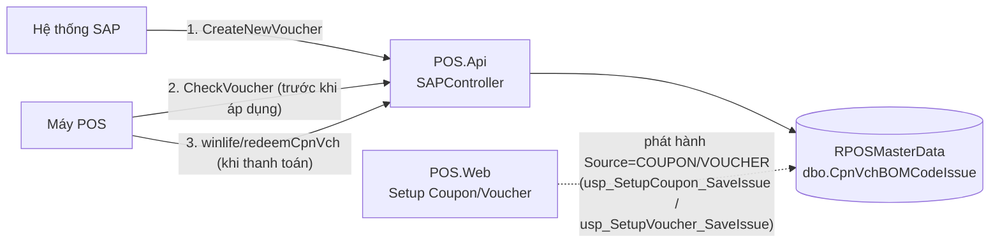

# Voucher Flow — SAP Internal Voucher / Coupon (`api/sap`)

> **Đối tượng đọc**: Team DEV tích hợp SAP ↔ POS.Api, và team POS.Web (Setup Coupon/Voucher) cần
> hiểu luồng liên thông dữ liệu.
> **Phạm vi**: 3 endpoint trong `SAPController` — `CheckVoucher`, `CreateNewVoucher`,
> `winlife/redeemCpnVch`.
> **Nguồn code đã trace trực tiếp** (không suy đoán):
> - `src/POS.Api/Controllers/SAPController.cs`
> - `src/POS.Application/Features/Sap/{ISAPService,SAPService}.cs`
> - `src/POS.Infrastructure/Repositories/CouponVoucher/{IVoucherCodeRepository,VoucherCodeRepository}.cs`
> - `src/POS.Infrastructure/Repositories/MasterData/CentralMDRepository.cs` (method `CpnVchBOMHeaderExistsAsync`)
> - `src/POS.Common/Dtos/SAP/SAPDto.cs`, `src/POS.Common/Dtos/Vouchers/VoucherStatusResponseDto.cs`
> - Script SQL gốc: `docs/sql/Voucher_Read.sql`, `docs/sql/Voucher_Save.sql`
> - Schema đối chiếu: `docs/architecture/centralMD-schema.md` (bảng `CpnVchBOMCodeIssue`,
>   `CpnVchBOMHeader`)
>
> Đây là kiến trúc **MỚI** (.NET 10, Clean Architecture) — **KHÔNG phải** source cũ
> `src/legacy/VCM.BLUEPOS`. Cả 3 API **không có `[Authorize]`** (đã kiểm tra `BaseController.cs`
> và `SAPController.cs` — không có attribute auth nào ở class hoặc action).

## 1. Tổng quan luồng nghiệp vụ

`SAPController` là điểm tích hợp real-time giữa SAP (ERP) và hệ thống voucher/coupon nội bộ. Cả 3
API đều thao tác trên **cùng 1 bảng** `dbo.CpnVchBOMCodeIssue` — bảng này dùng CHUNG cho 3 nguồn dữ
liệu (`Source = 'SAP' | 'COUPON' | 'VOUCHER'`), nên voucher do SAP tạo và coupon do POS.Web phát
hành **liên thông nhau hoàn toàn** qua đúng 3 API này (redeem/check không lọc theo `Source`).



**Luồng điển hình**: SAP gọi `CreateNewVoucher` để phát hành mã voucher mới → POS gọi
`CheckVoucher` để xác thực mã trước khi áp dụng lên hóa đơn → khi thanh toán xong, POS gọi
`winlife/redeemCpnVch` để đánh dấu mã đã sử dụng (chuyển `Status: SOLD → RDM`).

### ⚠️ Lưu ý contract — HTTP status PHẢN ÁNH đúng trạng thái nghiệp vụ

Khác với một số controller khác trong hệ thống (vd `SyncDataPosController` luôn trả HTTP 200),
**cả 3 API trong `SAPController` trả HTTP status ĐÚNG BẰNG `ResultResponse.Status`**:

```csharp
var result = await _sapService.XxxAsync(...);
return StatusCode((int)result.Status, result);   // HTTP status = business status
```

Ví dụ: voucher hết hạn → HTTP `400 BadRequest`; voucher không tồn tại → HTTP `404 NotFound`;
lỗi hệ thống (exception) → HTTP `500 InternalServerError`. Envelope response
(`src/POS.Common/ResultResponse.cs`):

```csharp
public class ResultResponse
{
    public HttpStatusCode Status { get; set; }        // "Status"
    public string Message { get; set; }                // "Message"
    public object? Data { get; set; }                  // "Data" — bị bỏ qua trong JSON nếu null (NullValueHandling.Ignore)
    public string MessageTechnical { get; set; }        // "MessageTechnical"
}
```

### DTO trả về chung — `VoucherStatusResponse`

Cả 3 API đều trả `Data` dưới dạng (hoặc list) `VoucherStatusResponse`
(`src/POS.Common/Dtos/Vouchers/VoucherStatusResponseDto.cs`):

```csharp
public class VoucherStatusResponse
{
    public string? Status { get; set; }                // SOLD | RDM | EXP | AVL
    public string? Return { get; set; }                 // "0"/"1" — legacy field
    public string? ActicleNo { get; set; }               // mã hàng SAP (chính tả gốc giữ nguyên)
    public string? ActicleType { get; set; }             // ZCPN | ZVCN (SAP) hoặc ArticleType (Coupon)
    public string? VoucherNumber { get; set; }
    public string? Value { get; set; }                   // mệnh giá, dạng string
    public string? Voucher_Currency { get; set; }         // luôn "VND"
    public string? Validity_From_Date { get; set; }       // "dd/MM/yyyy"
    public string? Expiry_Date { get; set; }               // "dd/MM/yyyy"
    public string? CompanyCode { get; set; }               // luôn "WCM"
    public string? Partner { get; set; }
    public bool? IsEmployee { get; set; }
    public string? PhoneNumber { get; set; }
    public string? VoucherType { get; set; }
    public decimal? AmountUsed { get; set; }
    public string? OrderUsed { get; set; }
}
```

---

## 2. API 1 — `GET api/sap/CheckVoucher`

Kiểm tra trạng thái hợp lệ của 1 mã voucher/coupon (dùng bởi POS trước khi áp dụng lên hóa đơn).

### 2.1 API Level

| | |
|---|---|
| Route | `GET api/sap/CheckVoucher` |
| Controller | `SAPController.CheckVoucher` (`SAPController.cs:18`) |

**Request (query string)**:

| Param | Kiểu | Bắt buộc | Có thực sự dùng? |
|---|---|---|---|
| `voucherNumber` | string | ✅ `[Required]` | ✅ Duy nhất tham số được dùng |
| `siteNo`, `posTerminal`, `companyCode`, `isEmployee`, `partner`, `isCardVoucher`, `phoneNumber` | string | ❌ | ❌ Nhận vào nhưng **KHÔNG** truyền xuống service — dead parameter |
| `quantity` | int (mặc định 1) | ❌ | ❌ Không dùng |
| `isVoucher` | bool (mặc định true) | ❌ | ❌ Không dùng |
| `isLog` | bool (mặc định true) | ❌ | ❌ Không dùng — **API này không ghi log request dù có tham số `isLog`** |

> Controller chỉ forward đúng 1 giá trị xuống tầng dưới:
> `_sapService.CheckVoucherAsync(voucherNumber, ct)` (`SAPController.cs:34`).

**Response**: `ResultResponse` — HTTP status **thay đổi theo kết quả nghiệp vụ**:

| Trường hợp | HTTP Status | `Message` |
|---|---|---|
| Không tìm thấy mã | `404 NotFound` | "Mã Voucher/Coupon không tồn tại" |
| `Status = RDM` (đã redeem) | `400 BadRequest` | "Mã Voucher/Coupon {code} đã được sử dụng" |
| Hết hạn (`Status=EXP` hoặc `Expiry_Date` < hôm nay) | `400 BadRequest` | "Mã Voucher/Coupon {code} đã hết hạn" |
| `Validity_From_Date` parse lỗi | `404 NotFound` | "Mã Voucher/Coupon không tồn tại" |
| Chưa đến ngày hiệu lực (`Validity_From_Date` > hôm nay) | `400 BadRequest` | "Voucher/coupon chưa đến ngày hiệu lực" |
| `Status = AVL` (chưa kích hoạt) | `400 BadRequest` | "Mã Voucher/Coupon {code} chưa được kích hoạt" |
| Hợp lệ | `200 OK` | "Success" |

### 2.2 Service/Logic Level

`SAPService.CheckVoucherAsync` (`SAPService.cs:63-113`):

1. Đọc bản ghi qua `voucherCodeRepository.GetByCodeAsync(voucherNumber, ct)`.
2. Validate **tuần tự** theo đúng thứ tự bảng trên (short-circuit tại điều kiện đầu tiên khớp) —
   thứ tự có ý nghĩa nghiệp vụ: `RDM` (đã dùng) → hết hạn → parse lỗi ngày bắt đầu → chưa hiệu lực
   → `AVL` (chưa kích hoạt) → hợp lệ.
3. Nhánh "chưa đến ngày hiệu lực" (L93-98) có side-effect đặc biệt: gán `data.Return = "1"` và
   `data.Status = "EXP"` **trên object trả về** (không ghi xuống DB) trước khi trả response.

### 2.3 Database Level

| Thao tác | SP | Table | Lock |
|---|---|---|---|
| Read | `dbo.usp_Voucher_GetByCode` | `dbo.CpnVchBOMCodeIssue` | `(NOLOCK)` |

SP (`docs/sql/Voucher_Read.sql`):

```sql
CREATE PROCEDURE dbo.usp_Voucher_GetByCode (@Code varchar(50))
AS
BEGIN
    SET NOCOUNT ON;
    SELECT TOP 1 [Status], [Return] = CAST([Return] AS VARCHAR), [ActicleNo], [ActicleType],
           [VoucherNumber] = [Code], [Value] = CAST([Value] AS VARCHAR), [Voucher_Currency],
           [Validity_From_Date] = CONVERT(VARCHAR, Validity_From_Date, 103),
           [Expiry_Date] = CONVERT(VARCHAR, Expiry_Date, 103),
           [CompanyCode], [Partner], [IsEmployee], [PhoneNumber], [VoucherType],
           [AmountUsed], [OrderUsed]
    FROM dbo.CpnVchBOMCodeIssue (NOLOCK)
    WHERE Code = @Code;
END
```

- **Không lọc theo `Source`** — `Code` unique toàn bảng (`UX_CpnVchBOMCodeIssue_Code`), nên API
  này nhận diện được cả mã `Source='SAP'` (do `CreateNewVoucher` tạo) lẫn mã `Source='COUPON'`/
  `'VOUCHER'` (do POS.Web phát hành qua `usp_SetupCoupon_SaveIssue` / `usp_SetupVoucher_SaveIssue`).
- `NOLOCK` — read thuần túy, không cần chờ lock của giao dịch tạo/redeem đang chạy.

---

## 3. API 2 — `POST api/sap/CreateNewVoucher`

SAP gọi để phát hành voucher mới vào hệ thống POS (idempotent — gọi lại với cùng `VoucherNumber`
không tạo trùng, không lỗi).

### 3.1 API Level

| | |
|---|---|
| Route | `POST api/sap/CreateNewVoucher` |
| Controller | `SAPController.CreateNewVoucher` (`SAPController.cs:77`) |

**Request body**: `List<CreateVoucherModel>` (`SAPDto.cs:6-24`):

| Field | Kiểu | Bắt buộc | Có thực sự dùng? |
|---|---|---|---|
| `VoucherNumber` | string | ✅ `[Required]` | ✅ Dùng làm `Code` |
| `Value` | decimal | ❌ | ✅ Mệnh giá |
| `From_Date` | string | ✅ `[Required]` | ✅ → `Validity_From_Date` |
| `Expiry_Date` | string | ✅ `[Required]` | ✅ |
| `Article_No` | string | ❌ | ✅ Dùng validate tồn tại + lưu `ActicleNo`/`ItemNo` |
| `VoucherType` | string | ❌ | ✅ |
| `SiteCode` | string | ✅ `[Required]` | ❌ **Không dùng** trong `SAPService` (nhận nhưng không map/lưu) |
| `POSTerminal` | string | ✅ `[Required]` | ❌ **Không dùng** |
| `BonusBuy` | string | ❌ | ❌ **Không dùng** |
| `OrderNo` | string | ❌ | ❌ **Không dùng** |

> `ActicleType` (trong response) **không nhận từ input** — service tự suy ra: nếu
> `VoucherNumber.Length >= 7 && VoucherNumber[6] == '3'` → `"ZCPN"`, ngược lại `"ZVCN"`
> (`SAPService.cs:31-33`).

**Response**: `ResultResponse.Data` = `List<VoucherStatusResponse>`.

| Trường hợp | HTTP Status |
|---|---|
| `Article_No` không rỗng và không tồn tại trong `CpnVchBOMHeader` (bất kỳ item nào trong list) | `400 BadRequest`, message `"ActicleNo {Article_No} không tồn tại"` — dừng **toàn bộ** batch, không tạo item nào |
| Thành công | `200 OK`, `Message = "Success"` |

### 3.2 Service/Logic Level

`SAPService.CreateNewVoucherAsync` (`SAPService.cs:13-61`):

1. **Validate trước — toàn bộ list**: với mỗi item có `Article_No` khác rỗng và khác
   `"10000001"` (mã đặc biệt bỏ qua check — dùng bởi `CreateReturnVoucher`, route khác không thuộc
   phạm vi tài liệu này), gọi `centralMDRepository.CpnVchBOMHeaderExistsAsync(item.Article_No, ct)`.
   Nếu **bất kỳ** item nào fail → trả lỗi ngay, **không tạo bất kỳ voucher nào trong batch** — lý
   do (comment gốc trong code): loop tạo phía dưới không nằm trong 1 transaction DB, nên phải chặn
   hết ở bước validate để tránh tạo dở dang.
2. Với mỗi item hợp lệ, map sang `VoucherStatusResponse` (`Status="SOLD"`, `Return="0"`,
   `Voucher_Currency="VND"`, `CompanyCode="WCM"`, `Partner="SAP"` — hard-code) rồi gọi
   `voucherCodeRepository.CreateOrGetAsync(mapped, ct)` — **tuần tự từng item, không transaction
   chung cho cả batch** (transaction chỉ nằm trong SP, ở mức 1 voucher).

### 3.3 Database Level

**a) Validate `Article_No`** — raw SQL, không phải SP (`CentralMDRepository.cs:372-387`):

```sql
SELECT TOP 1 1 FROM dbo.CpnVchBOMHeader (NOLOCK) WHERE [ItemNo] = @itemNo;
```

- Đọc `(NOLOCK)`.
- Có cache Redis Hash `MD:CpnVchBOMHeader` (positive-only, TTL 12h — chỉ cache `true`, không cache
  `false`, để tránh false-negative khi mã mới vừa được tạo).

**b) Tạo voucher** — SP `dbo.usp_Voucher_Create` (`docs/sql/Voucher_Save.sql:33-118`):

| Thao tác | SP | Table | Lock |
|---|---|---|---|
| Write (idempotent) | `dbo.usp_Voucher_Create` | `dbo.CpnVchBOMCodeIssue` | `WITH (UPDLOCK, HOLDLOCK)` trong transaction |

```sql
BEGIN TRANSACTION;

-- Chặn trùng Code ở Source khác (Coupon) — tránh vi phạm unique index bằng SqlException thô
IF EXISTS (
    SELECT 1 FROM dbo.CpnVchBOMCodeIssue WITH (UPDLOCK, HOLDLOCK)
    WHERE Code = @Code AND Source <> 'SAP'
)
    THROW 51000, N'Mã ... đã tồn tại dưới dạng mã coupon nội bộ, không thể tạo voucher SAP trùng mã', 1;

-- Idempotent: đã tồn tại (Source='SAP') thì KHÔNG insert lại, không lỗi
IF NOT EXISTS (
    SELECT 1 FROM dbo.CpnVchBOMCodeIssue WITH (UPDLOCK, HOLDLOCK)
    WHERE Code = @Code AND Source = 'SAP'
)
    INSERT INTO dbo.CpnVchBOMCodeIssue
        (ItemNo, Code, Enabled, CreatedDate, Source, Status, [Return], ActicleNo, ActicleType,
         Value, Voucher_Currency, Validity_From_Date, Expiry_Date, CompanyCode, Partner,
         PhoneNumber, VoucherType)
    VALUES
        (@ActicleNo, @Code, 1, GETDATE(), 'SAP', 'SOLD', 0, @ActicleNo, @ActicleType,
         TRY_CONVERT(decimal(18,2), @Value), @Voucher_Currency,
         TRY_CONVERT(date, @Validity_From_Date, 103), TRY_CONVERT(date, @Expiry_Date, 103),
         @CompanyCode, @Partner, @PhoneNumber, @VoucherType);

COMMIT TRANSACTION;

-- Luôn SELECT lại đúng 1 dòng hiện tại từ DB để trả về (dù vừa tạo hay đã có sẵn)
SELECT TOP 1 ... FROM dbo.CpnVchBOMCodeIssue (NOLOCK) WHERE Code = @Code AND Source = 'SAP';
```

- **`UPDLOCK, HOLDLOCK`** trên cả 2 câu `EXISTS` check — bắt buộc để chống race condition: 2 request
  tạo cùng `Code` đồng thời phải serialize qua nhau (1 request chờ lock của request kia), tránh cả 2
  cùng pass check "chưa tồn tại" rồi cùng insert → vi phạm `UX_CpnVchBOMCodeIssue_Code`.
- `ItemNo = @ActicleNo` (mirror) — cho phép tra cứu chéo theo `ItemNo` bất kể nguồn gốc Coupon hay
  SAP Voucher.
- Câu `SELECT` cuối cùng (trả kết quả) dùng `(NOLOCK)`, nằm **ngoài** transaction (đã COMMIT) —
  luôn đọc dữ liệu đã persist, không đọc object C# tạm.

---

## 4. API 3 — `POST api/sap/winlife/redeemCpnVch`

POS gọi khi thanh toán hoàn tất để đánh dấu voucher/coupon đã sử dụng (`SOLD → RDM`). Đây là API
**redeem dùng chung** cho cả voucher SAP (`Source='SAP'`) lẫn coupon nội bộ (`Source='COUPON'`/
`'VOUCHER'`, do POS.Web phát hành) — 2 luồng liên thông nhau qua đúng endpoint này.

### 4.1 API Level

| | |
|---|---|
| Route | `POST api/sap/winlife/redeemCpnVch` |
| Controller | `SAPController.RedeemCpnVch` (`SAPController.cs:154`) |

**Request body**: `VoucherUpdateModel` (`SAPDto.cs:26-52`):

| Field | Kiểu | Có thực sự dùng? |
|---|---|---|
| `ListSeriNo` | `List<VoucherUpdateSerial>` | ✅ Bắt buộc non-empty (kiểm tra ở controller, trả `400` nếu rỗng) |
| `OrderNo` | string | ✅ Dùng ghi `OrderUsed` |
| `TotalBill` | double | ❌ **Không dùng** |
| `SiteCode`, `POSTerminal` | string | ❌ **Không dùng** |
| `IsVoucher`, `IsRetry` | bool | ❌ **Không dùng** |
| `PhoneNumber` | string | ❌ **Không dùng** |

`VoucherUpdateSerial` (từng dòng trong `ListSeriNo`):

| Field | Kiểu | Có thực sự dùng? |
|---|---|---|
| `VoucherNumber` | string | ✅ |
| `Value` | double | ✅ — qua property tính toán `AmountRedeem` (xem ghi chú dưới) |
| `AmountRedeem` | double (get-only) | ⚠️ **Không phải field độc lập** — `{ get { return Value; } }`. Client gửi `Value` trong JSON, server tự suy `AmountRedeem = Value` khi map sang tuple gửi xuống repository. |
| `CompanyCode`, `Partner`, `IsVoucher`, `ArticleNo`, `ArticleType`, `Status` | — | ❌ **Không dùng** |

**Response**: `ResultResponse.Data` = `List<VoucherStatusResponse>` (các dòng vừa redeem thành công).

| Trường hợp | HTTP Status |
|---|---|
| `ListSeriNo` rỗng/null | `400 BadRequest`, "Danh sách voucher không được trống" |
| Redeem thất bại (xem lý do ở mục 4.3) | `400 BadRequest`, message do SP trả về |
| Thành công | `200 OK`, `Message = "OK"` |

### 4.2 Service/Logic Level

`SAPService.RedeemCpnVchAsync` (`SAPService.cs:115-128`):

1. Map `ListSeriNo` → `List<(VoucherNumber, AmountRedeem)>`.
2. Gọi `voucherCodeRepository.RedeemAsync(serials, model.OrderNo, ct: ct)` — **không** truyền
   `requiredVoucherType` (khác với `UpdateReturnVoucherAsync` — API `UpdateReturnVoucher`, route
   khác không thuộc phạm vi tài liệu này, truyền `requiredVoucherType: "BNMH"`).
3. `success = false` → trả `400 BadRequest` với message gốc từ SP.

### 4.3 Database Level

| Thao tác | SP | Table | Lock |
|---|---|---|---|
| Write (transaction) | `dbo.usp_Voucher_Redeem` | `dbo.CpnVchBOMCodeIssue` (+ TVP `dbo.VoucherRedeemTVP`) | `WITH (UPDLOCK, HOLDLOCK)` |

TVP đầu vào:

```sql
CREATE TYPE dbo.VoucherRedeemTVP AS TABLE (Code varchar(50) NULL, AmountRedeem decimal(18,2) NULL);
```

SP (`docs/sql/Voucher_Save.sql:125-251`) — logic rút gọn:

```sql
BEGIN TRANSACTION;

-- Khóa các dòng liên quan TRƯỚC khi kiểm tra điều kiện — chống 2 request redeem cùng lúc
-- cùng 1 mã (double-spend)
INSERT INTO @Found (Code, Status, VoucherType, Value)
SELECT c.Code, c.Status, c.VoucherType, c.Value
FROM dbo.CpnVchBOMCodeIssue c WITH (UPDLOCK, HOLDLOCK)
WHERE c.Code IN (SELECT Code FROM @Lines);

-- (1) Đủ số lượng dòng tìm thấy?
IF (SELECT COUNT(*) FROM @Found) <> @LineCount
    → ROLLBACK, message "Một hoặc nhiều voucher không tồn tại trong hệ thống"

-- (2) Tất cả đang ở Status = 'SOLD'?
ELSE IF EXISTS (SELECT 1 FROM @Found WHERE Status <> 'SOLD')
    → ROLLBACK, message "Voucher {Code} không ở trạng thái SOLD (hiện tại: {Status})"

-- (3) Nếu có @RequiredVoucherType, tất cả đúng loại? (API redeemCpnVch KHÔNG truyền tham số này)
ELSE IF @RequiredVoucherType IS NOT NULL AND EXISTS (... VoucherType <> @RequiredVoucherType)
    → ROLLBACK, message "Voucher {Code} không phải loại {RequiredVoucherType} (hiện tại: {VoucherType})"

-- (4) Số tiền redeem hợp lệ? (0 ≤ AmountRedeem ≤ Value, Value NULL cũng bị chặn tường minh)
ELSE IF EXISTS (... AmountRedeem < 0 OR Value IS NULL OR AmountRedeem > Value)
    → ROLLBACK, message "Voucher {Code}: số tiền redeem {x} không hợp lệ (mệnh giá: {y})"

-- Hợp lệ → cập nhật
ELSE
BEGIN
    UPDATE c SET c.Status = 'RDM', c.AmountUsed = l.AmountRedeem, c.OrderUsed = @OrderNo,
                 c.Enabled = 0
    FROM dbo.CpnVchBOMCodeIssue c JOIN @Lines l ON l.Code = c.Code;
    COMMIT TRANSACTION;
END

-- Trả kết quả: SELECT @Success, @Message, rồi (nếu Success=1) SELECT lại các dòng (NOLOCK)
```

- **`UPDLOCK, HOLDLOCK`** ngay ở câu `SELECT ... INTO @Found` đầu tiên — khóa toàn bộ dòng liên
  quan **trước** khi kiểm tra bất kỳ điều kiện nghiệp vụ nào, giữ khóa xuyên suốt transaction đến
  `COMMIT`/`ROLLBACK`. Đây là điểm mấu chốt chống **double-spend**: nếu 2 request redeem cùng lúc
  cùng 1 `Code`, request thứ 2 phải **chờ** request thứ 1 hoàn tất (commit/rollback) mới được đọc,
  đảm bảo không có 2 giao dịch cùng thấy `Status='SOLD'` và cùng redeem thành công.
- `Enabled = 0` khi redeem — đồng bộ với hiển thị "Locked" ở trang Setup Coupon (POS.Web,
  `usp_SetupCoupon_GetCodes` đọc cột `Enabled` chứ không đọc `Status`).
- **Không lọc theo `Source`** — áp dụng chung cho cả 3 nguồn `SAP`/`COUPON`/`VOUCHER`.
- Câu `SELECT` trả kết quả cuối cùng dùng `(NOLOCK)`, nằm ngoài transaction.

---

## 5. Bảng tổng hợp Database Access

| API | SP/Query | Table | R/W | Lock hint |
|---|---|---|---|---|
| `CheckVoucher` | `usp_Voucher_GetByCode` | `CpnVchBOMCodeIssue` | Read | `NOLOCK` |
| `CreateNewVoucher` | raw SQL (không SP) | `CpnVchBOMHeader` | Read | `NOLOCK` (+ cache Redis `MD:CpnVchBOMHeader`) |
| `CreateNewVoucher` | `usp_Voucher_Create` | `CpnVchBOMCodeIssue` | Write (idempotent) | `UPDLOCK, HOLDLOCK` (check) → `INSERT` trong transaction |
| `winlife/redeemCpnVch` | `usp_Voucher_Redeem` | `CpnVchBOMCodeIssue` (+ TVP `VoucherRedeemTVP`) | Write | `UPDLOCK, HOLDLOCK` (từ đầu transaction, chống double-spend) → `UPDATE` |

## 6. Ghi chú kiến trúc quan trọng

- **Bảng dùng chung 3 nguồn**: `dbo.CpnVchBOMCodeIssue` là bảng duy nhất chứa cả voucher SAP
  (`Source='SAP'`, tạo bởi `CreateNewVoucher`) và coupon/voucher nội bộ do POS.Web phát hành
  (`Source='COUPON'|'VOUCHER'`, qua `usp_SetupCoupon_SaveIssue`/`usp_SetupVoucher_SaveIssue` —
  ngoài phạm vi 3 API tài liệu này). `CheckVoucher` và `winlife/redeemCpnVch` **không lọc theo
  `Source`** nên xử lý được cả 2 loại.
- **Không có transaction cấp batch** ở tầng Application cho `CreateNewVoucher` — mỗi item trong
  list được tạo tuần tự qua 1 lời gọi SP riêng (SP tự có transaction ở mức 1 dòng); nếu request
  thứ N trong batch lỗi (vd exception hạ tầng giữa chừng), các item trước đó **đã được commit**,
  không rollback lại được toàn batch (validate `Article_No` ở bước đầu chỉ ngăn được lỗi nghiệp vụ
  đã biết trước, không ngăn được lỗi hạ tầng giữa chừng).
- **Idempotency chỉ có ở `CreateNewVoucher`** (SP tự kiểm tra tồn tại trước khi insert) — `Check`
  và `Redeem` không có khái niệm idempotent tương tự (redeem lần 2 cùng mã sẽ fail ở điều kiện
  `Status <> 'SOLD'`, đây là hành vi mong muốn — chặn redeem trùng).
- **3 API đều không có `[Authorize]`** — cần xác nhận việc bảo vệ endpoint (nếu có) nằm ở tầng
  khác (API Gateway/Network/Basic Auth theo IP nội bộ...), không nằm trong code `SAPController`.
