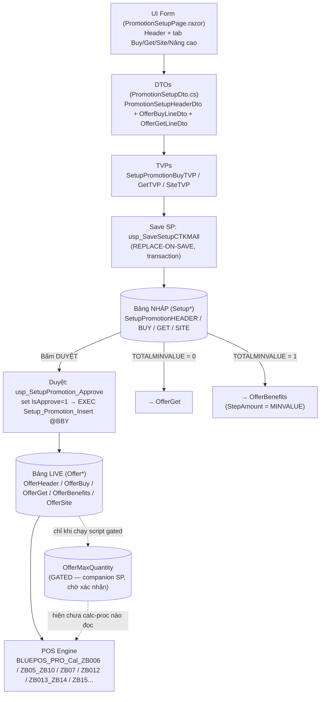

# PROMOTION SETUP MANUAL — Tài liệu vận hành & Kiểm thử trang Cài đặt CTKM

> **Đối tượng:** QA, BA, Dev, Tech Lead. **Trang:** `GET /promotion/setup` (POS.Web, Blazor Server).
> **DB:** `RPOSMasterData` (CentralMD). **Quyền:** policy `BackOfficeAndAbove` (ITOps/Admin...).
>
> Tài liệu tổng hợp 100% theo code thực tế (bản sửa lần 5, 2026-07-15). Nguồn đối chiếu:
> - UI: `src/POS.Web/Components/Pages/Promotion/Offers/PromotionSetupPage.razor`
> - Logic/validate/DTO: `src/POS.Infrastructure/Repositories/Promotion/PromotionRepository.cs`,
>   `src/POS.Common/Dtos/Promotion/PromotionSetupDto.cs`
> - SP Lưu tạm: `docs/sql/SetupPromotion_Save.sql` (`usp_SaveSetupCTKMAll`)
> - SP Duyệt/publish: `docs/web/offers/Setup_Promotion_Insert.sql` (`Setup_Promotion_Insert`)
> - Engine POS: `docs/web/offers/offer_procedure.sql` (`BLUEPOS_PRO_Cal_*`)
> - Kế hoạch nền tảng: `docs/web/offers/setup_offer_plan_V4.md`

## 0. Điều kiện tiên quyết (BẮT BUỘC chạy SQL trước khi test)

Chạy trên `RPOSMasterData` **đúng thứ tự** (xem `docs/ROLLOUT.md` §D1, `docs/sql/manifest.json`):

| # | Script | Mục đích | Bắt buộc |
|---|---|---|---|
| 1 | `SetupPromotion_AddNumOfDaysList.sql` (order 90) | Cột `NUMOFDAYSLIST` | ✅ |
| 2 | `SetupPromotion_AddMaxQuantity.sql` (order 95) | Cột `SetupPromotionHEADER.MaxQuantity` | ✅ (bản 5) |
| 3 | `SetupPromotion_Save.sql` (order 100) | TVP + `usp_SaveSetupCTKMAll` (bản 5) | ✅ |
| 4 | `SetupPromotion_ApproveAndStatus.sql` (order 110) | `usp_SetupPromotion_Approve` | ✅ |
| 5 | `Setup_Promotion_Insert` (production, đã có sẵn) | Publish nháp → Offer* | (không tạo lại) |
| 6 | `SetupPromotion_Insert_AddMaxQty.sql` (order 115, **GATED**) | Publish `OfferMaxQuantity` | ❌ chỉ chạy sau khi DBA/engine xác nhận |

> Thiếu script 2/3 → Lưu/Duyệt báo lỗi đỏ ("Lỗi hệ thống..."), chi tiết trong file log
> `D:\ROOT\Logs\POS.Web\Exception\log-yyyyMMdd.txt`.

---

# 1. KIẾN TRÚC LUỒNG DỮ LIỆU (DATA PIPELINE ARCHITECTURE)



## 1.1 Cơ chế bẻ hướng dòng Get theo `TOTALMINVALUE` (điểm CỐT LÕI)

`usp_SaveSetupCTKMAll` nhận `@TotalMinValue = (OfferType.IsTotalBill ? 1 : 0)` (gán tự động ở
`PromotionRepository.SaveSetupAsync`) → ghi cột `SetupPromotionHEADER.TOTALMINVALUE`.

Khi **Duyệt**, `Setup_Promotion_Insert` đọc cột này để quyết định đích của các dòng `SetupPromotionGET`:

| `TOTALMINVALUE` | Đích publish | Cột `StepAmount` | Loại CTKM điển hình |
|---|---|---|---|
| **0** | `OfferGet` (`WHERE ISNULL(H.TOTALMINVALUE,0)=0`) | — | ZB02, ZB05, ZB07, ZB08, ZB10 |
| **1** | `OfferBenefits` (`WHERE ISNULL(H.TOTALMINVALUE,0)=1`) | `= H.MINVALUE` | ZB06, ZB12, ZB13, ZB14, ZB15 |

> ⚠️ **Lỗi gốc đã fix (bản 5):** trước đây luồng lưu KHÔNG hề set `TOTALMINVALUE` → luôn = 0 →
> `OfferBenefits` **không bao giờ** được sinh cho CTKM tổng bill. Nay đã gán đúng.

## 1.2 Ánh xạ cột — HEADER (UI → SetupPromotionHEADER → OfferHeader)

| Trường UI | DTO | SetupPromotionHEADER | OfferHeader (sau Duyệt) |
|---|---|---|---|
| Mã CTKM (auto) | `No` | `BBYNR` | `No`, `PKEY` |
| Tên CTKM | `Description` | `BBYTEXT`, `PROMOTIONTEXT` | `Description` |
| Hình thức bán | `SalesType` | `SalesType` | `SalesTypeFilter`, `SalesType` |
| Loại CTKM | `OfferType` | `BBYTYPE` | `OfferType` |
| Trạng thái | `Status` | `STATUS` | `Status` (CAST int) |
| Từ ngày / Đến ngày | `StartingDate`/`EndingDate` | `VALIDFROM`/`VALIDTO` (yyyyMMdd) | `StartingDate`/`EndingDate` |
| Voucher/Coupon | `IsVoucher` | `IsVoucher` | `IsVoucher` |
| Điều kiện Buy (AND/OR) | `ConditionBuy` | `BUYLINKCAT` ('A'/'O') | `ConditionBuy` (A→2, O→1) |
| Điều kiện Get (AND/OR) | `ConditionGet` | `GETLINKCAT` ('A'/'O') | `ConditionGet` (A→2, O→1) |
| **Ngưỡng tổng bill** | `MinValue` | `MINVALUE` | `MinValue`; **+ OfferBenefits.StepAmount** |
| **(auto) cờ tổng bill** | `IsTotalBill` | `TOTALMINVALUE` ('0'/'1') | `IsTotalBill`; **bẻ hướng Get** |
| Giới hạn KH | `LimitQty` | `LIMIT` | `LimitQty` (rỗng/null → **9999**) |
| Chỉ thành viên | `MemberOnly` | `VINID` ('X'/'') | `MemberOnly` (X→1) |
| Hạng thẻ | `MemberCode` | `MemberCode` | `MemberCode`, `MemberAttribute` |
| **Độ ưu tiên (1–10)** | `PriorityBBY` | `ZPRIOR` | `PriorityBBY` (rỗng→1) |
| **Giới hạn SL KM** | `MaxQuantity` | `MaxQuantity` | *(gated)* `OfferMaxQuantity.MaxQuantity` |
| Ngày áp dụng trong tháng | `ApplyDaysOfMonth` | `NUMOFDAYSLIST` (JSON) | *(KHÔNG publish)* |
| Từ giờ / Đến giờ | `FromTime`/`ToTime` | `TIMEFROM`/`TIMETO` | `FromTime`/`ToTime` |
| Mon..Sun | `Mon`..`Sun` | `MON`..`SUN` ('X'/'') | `Mon`..`Sun` (X→1) + `DayOfWeek` |
| Voucher từ/đến ngày | `VoucherFromDate`/`To` | `ZVCDATE_ST`/`EN` | `VoucherFromDate`/`To` |
| Số ngày hiệu lực VC | `VoucherValidDay` | `ZVCDATE_VA` | `VoucherValidDay` |
| Số lần phát hành VC | `VoucherLimitNumber` | `LIMITNR` | `VoucherLimitNumber` |
| Giảm giá tổng bill (whole-bill) | `CheckTotalDiscount` | `TOTALDISCOUNT` ('X'/'') | *(dùng cho whole-bill)* |
| Loại giảm tổng bill | `TotalDiscountType` | `TOTALDISCOUNTTYPE` (**'%'/'R'/'P'**) | `TotalDiscountType` (%→0, P→2, else 1) |
| Giá trị giảm tổng bill | `TotalDiscountValue` | `TOTALDISCOUNTVALUE` | `TotalDiscountValue` |

## 1.3 Ánh xạ cột — BUY (tab "Sản phẩm mua")

| Trường UI | DTO | SetupPromotionBUY | OfferBuy (publish — **loại trừ ZB06/ZB13**) |
|---|---|---|---|
| Loại (SP/Nhóm) | `LineType` (0/1) | `BUYTYPE` ('MAT'/'MGP') | `LineType` (MAT→0, MGP→1) |
| Barcode | `No` | `MAT_NR` | `No` = `RIGHT(MAT_NR,8)` |
| Mã nhóm SP | `GroupCode` | `MATGROUP` | `LineGroup` (hoặc B1/B.., O.. tùy LINKCAT) |
| ĐVT | `UnitOfMeasure` | `MEINH` | `UnitOfMeasure` |
| Số lượng | `Quantity` (default 1) | `MAT_QUAN` | `Quantity`, **`Step` = Quantity** |
| Điều kiện (ScaleType) | `ScaleType` (A/B/C) | `ScaleType` | `ScaleType` |
| **Loại KM (Buy)** | `DiscountType` (0/1/2) | `DiscountType` | `DiscountType` |
| **Giá trị** | `DiscountValue` | `DiscountValue` | `DiscountValue` |

## 1.4 Ánh xạ cột — GET (tab "Sản phẩm khuyến mãi") → OfferGet **hoặc** OfferBenefits

| Trường UI | DTO | SetupPromotionGET | OfferGet (TOTALMINVALUE=0) | OfferBenefits (TOTALMINVALUE=1) |
|---|---|---|---|---|
| Loại | `LineType` | `GETTYPE` ('MAT'/'MGP') | `LineType` | `Type` |
| Barcode | `No` | `MATERIALCODE` | `No` | `No` |
| ĐVT | `UnitOfMeasure` | `MEINH` | `UnitOfMeasure` | `UnitOfMeasure` |
| Số lượng | `Quantity` (default 1) | `QTY` | `Quantity`, `Step` | `Quantity` |
| Điều kiện (ScaleType) | `ScaleType` | `SCALETYPE` | `ScaleType` | *(không dùng)* |
| Loại KM | `DiscountType` (0/1/2) | `DISTYPE` ('%'/'R'/'P') | `DiscountType` (%→0,P→2,else1) | `ValueType` (%→0,P→2,else1) |
| Giá trị | `DiscountValue` | `BBYPER` (nếu %) **hoặc** `BBYVAL` | `DiscountValue` | `Value` |
| *(ngưỡng bill)* | `MinValue` (header) | `MINVALUE` (header) | — | **`StepAmount` = MINVALUE** |

## 1.5 Ánh xạ cột — SITE (tab "Cửa hàng")

| Trường UI | DTO | SetupPromotionSITE | OfferSite |
|---|---|---|---|
| Nhóm cửa hàng | `SiteGroupCode` | `SITEGROUPCODE` | `PriceGroupCode` |
| *(bung từ nhóm)* | — (repo `BuildSiteTableAsync`) | `SITECODE` | `StoreNo` |

> Repository tự "bung" `SiteGroupCode` → danh sách `StoreNo` (đọc `SetupGroupSite.ListStore`, hỗ trợ
> literal `"ALL"`) TRƯỚC khi gọi SP.

---

# 2. MA TRẬN CẤU HÌNH THEO LOẠI (OFFER TYPE MATRIX)

> UI điều khiển theo **cờ động `dbo.OfferType`** (`IsSetupBuy`/`IsSetupGet`/`IsTotalBill`/`IsVoucher`/
> `IsGift`) + 2 tập ngoại lệ nghiệp vụ hardcode trong `PromotionOfferTypeRules` (bù cờ DB có thể lệch,
> KHÔNG cần sửa DB):
> - `BuyHiddenOfferTypes = { ZB06, ZB13 }` → **ẩn** tab Buy (publish loại 2 mã này khỏi `OfferBuy`).
> - `BuyOptionalOfferTypes = { ZB05, ZB10 }` → Buy **không bắt buộc** (nghiệp vụ chỉ có Get).
> - Buy **bắt buộc** ⇔ `IsSetupBuy=1` **VÀ** OfferType ∉ (BuyHidden ∪ BuyOptional).

| Loại | Tab Buy | Tab Get | Ngưỡng tổng bill (MinValue) | Voucher | Ghi chú publish |
|---|---|---|---|---|---|
| **ZB02** (Combo/Tặng SP) | Hiện, bắt buộc | Hiện, bắt buộc | Ẩn | — | Buy `DiscountType=2` + `DiscountValue`=giá combo; IsGift → dòng Get là quà |
| **ZB05** (Giảm giá SP — hàng cân) | Ẩn/không bắt buộc | Hiện, bắt buộc | Ẩn | — | Get → `OfferGet`; ScaleType A/B/C quyết định cách giảm |
| **ZB06** (Tổng bill → giảm list SP) | **Ẩn** | Hiện, bắt buộc | **Hiện** (tab Thông tin chung), > 0 | — | Get → `OfferBenefits` (StepAmount=MinValue) |
| **ZB07** (Mua đạt X → giảm B) | Hiện, bắt buộc | Hiện, bắt buộc | Ẩn | — | Buy `DiscountValue` = ngưỡng giá trị bill |
| **ZB10** (Giảm giá SP — hàng thường) | Ẩn/không bắt buộc | Hiện, bắt buộc | Ẩn | — | Get → `OfferGet` |
| **ZB13** (Tổng bill → Voucher) | **Ẩn** | Hiện, bắt buộc | **Hiện**, > 0 | ✅ (khoá) | Get → `OfferBenefits`; **không có Buy** |
| **ZB14** (Nhóm SP + tổng bill → VC) | **Hiện** (theo `IsSetupBuy`) | Hiện, bắt buộc | **Hiện**, > 0 | ✅ (khoá) | **VẪN có Buy** (khác ZB13) |
| **ZB15** (Mua nhóm hoặc tổng bill → VC) | **Hiện** (theo `IsSetupBuy`) | Hiện, bắt buộc | **Hiện**, > 0 | ✅ (khoá) | **VẪN có Buy** (khác ZB13) |

> **Voucher tự động:** khi chọn OfferType có `IsVoucher=1`, checkbox "Voucher/Coupon" tự tick và
> **khoá** (`OnOfferTypeChanged`). Loại tổng bill → checkbox "Giảm giá tổng bill" (whole-bill) **bị ẩn**
> và `CheckTotalDiscount` bị reset false (tránh xoá nhầm dòng Get là benefits).

## 2.1 Ý nghĩa `ScaleType` (cột "Điều kiện áp dụng")

Áp dụng cho dòng Get (ZB05/ZB10/ZB07...) — quyết định cách engine POS chia số lượng hưởng KM
(khai báo `Quantity = n`):

| Giá trị | Nhãn UI (Get) | Ý nghĩa (engine) |
|---|---|---|
| **A** | Tối thiểu (From) | Giảm giá **từ** SP thứ `n+1` trở đi (mua n cái đầu giá thường) |
| **B** | Tối đa (Upto) | Giảm tối đa `n` SP; SP thứ `n+1` trở đi giá thường |
| **C** | Bằng (Equal) | Giảm khi mua **đúng** bội số của `n` |

> Tab Buy dùng nhãn ngắn: A=Tối thiểu, B=Tối đa, C=Bằng.

## 2.2 Ý nghĩa `DiscountType` (cột "Loại khuyến mãi" / "Loại KM (Buy)")

| Giá trị | Nhãn UI | DISTYPE (Get) | Ý nghĩa `DiscountValue` |
|---|---|---|---|
| **0** | Phần trăm (%) | `%` (lưu `BBYPER`) | % giảm giá |
| **1** | Số tiền | `R` (lưu `BBYVAL`) | Số tiền giảm cố định |
| **2** | Giá cố định | `P` (lưu `BBYVAL`) | Giá bán KM ấn định (ZB02 combo) |

> Riêng tab **Buy**: đa số loại để mặc định `0`; **ZB02** dùng `2` (giá combo), **ZB07** nhập `DiscountValue`
> làm ngưỡng giá trị bill (không phụ thuộc DiscountType).

## 2.3 Trường "Cài đặt nâng cao" — mặc định & giới hạn nhập

| Trường | DTO | Mặc định | Min | Max | Ghi chú |
|---|---|---|---|---|---|
| Giới hạn KH / Limit by customer | `LimitQty` | 0 | 0 | — | 0 = không giới hạn (engine coi = **99** lần lặp) |
| Độ ưu tiên | `PriorityBBY` | 1 | 1 | 10 | `ZPRIOR` → `OfferHeader.PriorityBBY` |
| Giới hạn SL KM tối đa | `MaxQuantity` | 0 | 0 | — | 0 = không giới hạn riêng (gated → OfferMaxQuantity) |
| Số lượng dòng Buy/Get (mỗi dòng) | `Quantity` | 1 | 1 | — | Bắt buộc ≥ 1 (chống Step=0) |

---

# 3. QUY TẮC KIỂM TRA TÍNH HỢP LỆ (VALIDATION RULES)

## 3.1 Client-side (Razor)

- **Chặn bấm "Lưu tạm"** (`CanSave` — nút disable) khi thiếu **hiển nhiên** 1 trong:
  `Description`, `SalesType`, `OfferType` (khi tạo mới), Từ ngày, Đến ngày.
- **`Required`/`RequiredError`** trên `MudSelect`/`MudTextField`/`MudDatePicker`: Hình thức bán, Tên CTKM,
  Loại CTKM, Từ ngày, Đến ngày.
- **Ẩn/hiện tab theo cờ** (mục 2): Buy ẩn cho ZB06/ZB13 & loại `IsSetupBuy=0`; Get ẩn khi `IsSetupGet=0`.
- **Confirm xoá Get** khi bật "Giảm giá tổng bill" (`MudMessageBox`).
- **Section ẩn → gửi list rỗng** (không lưu dữ liệu thừa của loại khác).

> ⚠️ Client-side chỉ là UX giảm round-trip. **Rule thật nằm ở Repository** (mục 3.2) — kể cả so sánh
> ngày, Quantity≥1, MinValue>0, đủ dòng Buy/Get... đều chỉ hiện lỗi **sau khi** bấm Lưu (qua Snackbar).

## 3.2 Server-side (`PromotionRepository.SaveSetupAsync` — nguồn sự thật)

| # | Điều kiện lỗi | Thông báo (Snackbar đỏ) |
|---|---|---|
| 1 | `Description` rỗng | Vui lòng nhập tên chương trình khuyến mãi |
| 2 | `SalesType` rỗng | Vui lòng chọn hình thức bán hàng |
| 3 | `OfferType` rỗng (khi tạo mới) | Vui lòng chọn loại CTKM |
| 4 | `Status` ∉ {0,1,2} | Trạng thái không hợp lệ |
| 5 | Từ ngày sai định dạng | Ngày bắt đầu không đúng định dạng (dd/MM/yyyy) |
| 6 | Đến ngày sai định dạng | Ngày kết thúc không đúng định dạng (dd/MM/yyyy) |
| 7 | Đến ngày < Từ ngày | Ngày kết thúc phải lớn hơn hoặc bằng ngày bắt đầu |
| 8 | `CheckTotalDiscount` mà `TotalDiscountValue ≤ 0` | Vui lòng nhập giá trị khuyến mãi cho giảm giá tổng bill |
| 9 | Có nhập giờ nhưng thiếu 1 vế | Vui lòng nhập đủ Từ giờ và Đến giờ |
| 10 | Giờ sai định dạng | Từ giờ/Đến giờ không đúng định dạng (HH:mm) |
| 11 | Đến giờ ≤ Từ giờ | Đến giờ phải lớn hơn Từ giờ |
| 12 | **Buy bắt buộc mà 0 dòng** (IsSetupBuy && ∉ BuyHidden/BuyOptional) | Loại CTKM này cần ít nhất 1 dòng Sản phẩm mua |
| 13 | **Get bắt buộc mà 0 dòng** (IsSetupGet) | Loại CTKM này cần ít nhất 1 dòng Sản phẩm khuyến mãi |
| 14 | **IsTotalBill mà `MinValue ≤ 0`** | CTKM tổng bill cần nhập Giá trị tổng bill tối thiểu (> 0) |
| 15 | **Dòng Buy/Get có `Quantity < 1`** | Số lượng của mỗi dòng sản phẩm phải ≥ 1 |
| 16 | **IsVoucher mà thiếu voucher từ/đến ngày** | CTKM Voucher/Coupon cần nhập Voucher từ ngày và đến ngày |

> "1 dòng đã nhập" = LineType 0 có mã SP (`No`), hoặc LineType 1 có mã nhóm (`GroupCode`) —
> helper `HasLineItem`.

## 3.3 Database-level (SP)

- `usp_SaveSetupCTKMAll`: `THROW 51001` — "CTKM {mã} đã được DUYỆT, không được phép lưu tạm"
  (khi `IsApprove=1`). Repository bắt qua `KnownBusinessErrorNumbers`, hiện nguyên message.
- `usp_SetupPromotion_Approve`: `THROW 51002` — "Không tìm thấy CTKM" khi Duyệt.
- Lỗi kỹ thuật khác (SP chưa deploy, timeout...) → message chung **"Lỗi hệ thống, vui lòng thử lại
  hoặc liên hệ IT."**, chi tiết trong file log.
- `Setup_Promotion_Insert` (khi Duyệt): CTKM voucher (ZB13/14/15/16) thiếu voucher date hợp lệ →
  tự set `OfferHeader.Status=2` (vô hiệu) + Remark.

---

# 4. BỘ KỊCH BẢN KIỂM THỬ CHI TIẾT (STEP-BY-STEP TEST CASES)

> Tiền điều kiện chung: đã chạy SQL §0; đăng nhập ITOps/Admin; có ≥1 SP trong `dbo.Item`, ≥1 nhóm
> cửa hàng trong `dbo.SetupGroupSite`. Ký hiệu `@BBY` = mã CTKM sinh ra (vd `6000000001`).

## TC-1 — ZB05 / ZB10 (Giảm giá sản phẩm — Get Only)

**1) Nhập UI:**
- Header: Tên="Giảm 20% SP A", Loại=**ZB05** (hoặc ZB10), Hình thức bán=Tại chỗ, Từ/Đến ngày hợp lệ.
- Tab **Buy**: ẩn (hoặc hiện nhưng để trống — không bắt buộc).
- Tab **Get**: 1 dòng — SP A, ĐVT, Số lượng=1, Điều kiện=**Bằng (Equal / C)**, Loại KM=**Phần trăm**, Giá trị=20.
- Nâng cao: để mặc định.

**2) Sau khi LƯU (nháp):**
- `SetupPromotionHEADER`: `BBYTYPE='ZB05'`, `TOTALMINVALUE='0'`, `MINVALUE='0'`, `STATUS`, `VALIDFROM/TO`.
- `SetupPromotionGET`: 1 dòng — `GETTYPE='MAT'`, `MATERIALCODE`=SP A, `QTY='1'`, `SCALETYPE='C'`,
  `DISTYPE='%'`, `BBYPER='20'`, `BBYVAL='0'`.
- `SetupPromotionBUY`: **0 dòng**.

**3) Sau khi DUYỆT (live):**
- `OfferHeader`: `No=@BBY`, `OfferType='ZB05'`, `IsTotalBill=0`.
- `OfferGet`: 1 dòng — `No`=SP A, `DiscountType=0`, `DiscountValue=20`, `Quantity=1`, `Step=1`, `ScaleType='C'`.
- `OfferBenefits`, `OfferBuy`: **0 dòng**.

**4) POS Engine (`BLUEPOS_PRO_Cal_ZB05_ZB10`):** đọc `OfferGet` → theo `ScaleType='C'` giảm 20% khi
mua đúng bội số Quantity=1; `LimitQty` chặn số lần lặp.

## TC-2 — ZB07 (Mua đạt giá trị X → giảm giá B)

**1) Nhập UI:**
- Header: Tên="Mua ≥100k SP X → mua Y giá KM", Loại=**ZB07**, ngày hợp lệ.
- Tab **Buy**: 1 dòng — SP X, Số lượng=1, **Loại KM (Buy)=Giá cố định (2)** *hoặc* để %; **Giá trị=100000** (ngưỡng bill).
- Tab **Get**: 1 dòng — SP Y, Số lượng=1, Loại KM=**Giá cố định**, Giá trị=10000 (giá bán KM).

**2) Sau khi LƯU:**
- `SetupPromotionHEADER`: `BBYTYPE='ZB07'`, `TOTALMINVALUE='0'`.
- `SetupPromotionBUY`: 1 dòng — `BUYTYPE='MAT'`, `MAT_NR`=X, `MAT_QUAN='1'`, `DiscountValue='100000'`.
- `SetupPromotionGET`: 1 dòng — `MATERIALCODE`=Y, `DISTYPE='P'`, `BBYVAL='10000'`.

**3) Sau khi DUYỆT:**
- `OfferBuy`: 1 dòng — `No`=X, `DiscountValue=100000`, `Quantity=1`, `Step=1`.
- `OfferGet`: 1 dòng — `No`=Y, `DiscountType=2`, `DiscountValue=10000`.

**4) POS Engine (`BLUEPOS_PRO_Cal_ZB07*`):** khi bill mua SP X đạt ngưỡng `OfferBuy.DiscountValue`
(100k) → cho mua SP Y (OfferGet) với giá KM; loop theo `LimitQty`.

## TC-3 — ZB02 (Combo giá cố định)

**1) Nhập UI:**
- Header: Tên="Combo bánh + café 50k", Loại=**ZB02**, ngày hợp lệ.
- Tab **Buy**: dòng combo — SP (hoặc nhóm) tạo combo, Số lượng theo combo, **Loại KM (Buy)=Giá cố định (2)**,
  **Giá trị=50000** (giá bán combo).
- Tab **Get**: SP được tặng/khuyến mãi (nếu có), Loại KM tùy nghiệp vụ.

**2) Sau khi LƯU:**
- `SetupPromotionHEADER`: `BBYTYPE='ZB02'`, `TOTALMINVALUE='0'`.
- `SetupPromotionBUY`: `DiscountType='2'`, `DiscountValue='50000'`, `MAT_QUAN` theo combo.

**3) Sau khi DUYỆT:**
- `OfferBuy`: `DiscountType=2`, `DiscountValue=50000`.
- `OfferGet`: dòng SP KM tương ứng (nếu có).

**4) POS Engine (`BLUEPOS_PRO_Cal_ZB08`/ZB02 combo):** nhận diện combo, bán theo giá cố định 50k.

## TC-4 — ZB06 (Khuyến mãi tổng hóa đơn — MinValue + LimitQty)

**1) Nhập UI:**
- Header: Tên="Bill ≥100k giảm 50% SP X (tối đa 5 SP/bill)", Loại=**ZB06**, ngày hợp lệ.
- Tab **Buy**: **ẩn**.
- Tab **Thông tin chung**: **Giá trị tổng bill tối thiểu = 100000**.
- Tab **Get** (SP hưởng KM): 1 dòng — SP X, **Số lượng=5**, Loại KM=Phần trăm, Giá trị=50.
- Nâng cao: **Limit by customer (LimitQty)=1**, Độ ưu tiên=5.

**2) Sau khi LƯU:**
- `SetupPromotionHEADER`: `BBYTYPE='ZB06'`, **`TOTALMINVALUE='1'`**, `MINVALUE='100000'`, `LIMIT='1'`, `ZPRIOR='5'`.
- `SetupPromotionGET`: 1 dòng — `MATERIALCODE`=X, `QTY='5'`, `DISTYPE='%'`, `BBYPER='50'`.
- `SetupPromotionBUY`: **0 dòng**.

**3) Sau khi DUYỆT:**
- `OfferHeader`: `IsTotalBill=1`, `MinValue=100000`, `LimitQty=1`, `PriorityBBY=5`.
- **`OfferBenefits`**: 1 dòng — `No`=X, `ValueType=0`, `Value=50`, **`StepAmount=100000`**, `Quantity=5`,
  `LineGroup='O1'`.
- `OfferGet`, `OfferBuy`: **0 dòng**.

**4) POS Engine (`BLUEPOS_PRO_Cal_ZB006_ByOfferNo`):**
- `@StepAmount = OfferBenefits.StepAmount = 100000` (ngưỡng bill).
- `@StepQty = OfferBenefits.Quantity = 5` (SL tối đa hưởng mỗi lần lặp).
- `@LimitQty = OfferHeader.LimitQty = 1` (số lần lặp; 0→99).
- Vòng lặp `WHILE @ApplyNumber ≤ @LimitQty AND @RemainAmount ≥ @StepAmount` → **chặn tối đa
  `Quantity × LimitQty = 5 × 1 = 5` SP** được giảm 50%. (`OfferRetrict.Status=1` loại thêm item nếu có.)

> **Test chéo:** đặt `Quantity=1, LimitQty=5` → cũng cap 5 SP nhưng mỗi lần 1 SP × 5 lần lặp.

## TC-5 — ZB13 vs ZB14/ZB15 (Phát hành Voucher)

**A) ZB13 — tổng bill → VC, KHÔNG có điều kiện mua:**
- Header: Loại=**ZB13** → checkbox Voucher tự tick & khoá. Tab **Buy ẩn**.
- Thông tin chung: MinValue=200000.
- Tab **Get**: SP/nhóm VC được phát (Value = mệnh giá).
- Nâng cao → thẻ Voucher: **Voucher từ/đến ngày (bắt buộc)**, Số ngày hiệu lực, Số lần phát hành.
- LƯU: `TOTALMINVALUE='1'`, `ZVCDATE_ST/EN` = ngày voucher, `LIMITNR`. `SetupPromotionBUY`=0 dòng.
- DUYỆT: `OfferBenefits` (StepAmount=200000) + `OfferHeader.IsVoucher=1`, VoucherFromDate/To.
  Nếu **bỏ trống voucher date** → publish tự `OfferHeader.Status=2` (vô hiệu) — negative test.

**B) ZB14 / ZB15 — CÓ điều kiện mua nhóm SP:**
- Header: Loại=**ZB14** (hoặc ZB15) → Voucher tự tick & khoá. Tab **Buy HIỆN** (khác ZB13).
- Tab **Buy**: nhóm SP điều kiện mua (LineType=Nhóm SP, mã nhóm), Số lượng≥1.
- Thông tin chung: MinValue (ngưỡng bill).
- Tab **Get**: VC được phát.
- LƯU: `SetupPromotionBUY` **có dòng** (`BUYTYPE='MGP'`, `MATGROUP`=mã nhóm), `TOTALMINVALUE='1'`.
- DUYỆT: `OfferBuy` **có dòng** (ZB14/15 KHÔNG bị loại như ZB13) + `OfferBenefits` + voucher fields.

**4) POS Engine (`BLUEPOS_PRO_Cal_ZB013_ZB14` / `ZB15`):** khi đủ điều kiện (mua nhóm + tổng bill) →
phát hành 1 VC (MaxQuantity = VoucherLimitNumber); trên nhiều CTKM VC cùng thoả, hệ thống phát VC lợi
nhất cho khách.

---

# 5. CHECKLIST CÂU LỆNH SQL VERIFY DATABASE (SSMS)

> Thay `@BBY` bằng mã CTKM cần kiểm (vd `6000000001`).

## 5.1 Bảng NHÁP (sau khi LƯU)

```sql
DECLARE @BBY nvarchar(20) = N'6000000001';

-- Header nháp
SELECT BBYNR, BBYTYPE, BBYTEXT, SalesType, STATUS, VALIDFROM, VALIDTO,
       TOTALMINVALUE, MINVALUE, MaxQuantity, LIMIT AS LimitQty, ZPRIOR AS Priority,
       VINID, MemberCode, IsVoucher, IsApprove, BUYLINKCAT, GETLINKCAT,
       ZVCDATE_ST, ZVCDATE_EN, ZVCDATE_VA, LIMITNR,
       TOTALDISCOUNT, TOTALDISCOUNTTYPE, TOTALDISCOUNTVALUE
FROM   dbo.SetupPromotionHEADER WHERE BBYNR = @BBY;

-- Buy nháp (chú ý DiscountType/DiscountValue bản 5)
SELECT BBYNR, BUYTYPE, MAT_NR, MATGROUP, MAT_QUAN, MEINH, ScaleType,
       DiscountType, DiscountValue
FROM   dbo.SetupPromotionBUY WHERE BBYNR = @BBY ORDER BY ID;

-- Get nháp
SELECT BBYNR, GETTYPE, MATERIALCODE, MATGROUP, QTY, MEINH, SCALETYPE,
       DISTYPE, BBYPER, BBYVAL
FROM   dbo.SetupPromotionGET WHERE BBYNR = @BBY ORDER BY ID;

-- Site nháp (đã bung theo store)
SELECT BBYNR, SITEGROUPCODE, SITECODE
FROM   dbo.SetupPromotionSITE WHERE BBYNR = @BBY ORDER BY ID;
```

## 5.2 Bảng LIVE (sau khi DUYỆT)

```sql
DECLARE @BBY nvarchar(20) = N'6000000001';

-- Header live
SELECT [No], OfferType, Description, Status, IsTotalBill, IsVoucher,
       MinValue, LimitQty, PriorityBBY, ConditionBuy, ConditionGet,
       LocalSiteGroup, VoucherFromDate, VoucherToDate, VoucherValidDay, VoucherLimitNumber,
       TotalDiscountType, TotalDiscountValue, Remark, Status AS StatusCheckDisabled
FROM   dbo.OfferHeader WHERE [No] = @BBY;

-- Buy live (RỖNG với ZB06/ZB13)
SELECT OfferNo, LineNo, LineType, [No], UnitOfMeasure, DiscountType, DiscountValue,
       Quantity, Step, LineGroup, ScaleType
FROM   dbo.OfferBuy WHERE OfferNo = @BBY ORDER BY LineNo;

-- Get live (khi TOTALMINVALUE=0)
SELECT OfferNo, LineNo, LineType, [No], UnitOfMeasure, DiscountType, DiscountValue,
       Quantity, Step, LineGroup, ScaleType
FROM   dbo.OfferGet WHERE OfferNo = @BBY ORDER BY LineNo;

-- Benefits live (khi TOTALMINVALUE=1) — kiểm StepAmount = MinValue
SELECT OfferNo, LineNo, [Type], [No], ValueType, [Value], StepAmount,
       LineGroup, Quantity, UnitOfMeasure
FROM   dbo.OfferBenefits WHERE OfferNo = @BBY ORDER BY LineNo;

-- Site live
SELECT OfferNo, PriceGroupCode, StoreNo FROM dbo.OfferSite WHERE OfferNo = @BBY ORDER BY StoreNo;

-- (GATED) OfferMaxQuantity — chỉ có dữ liệu nếu đã chạy SetupPromotion_Insert_AddMaxQty.sql
SELECT OfferNo, StoreNo, ItemNo, UOM, MaxQuantity, Status
FROM   dbo.OfferMaxQuantity WHERE OfferNo = @BBY;
```

## 5.3 Đối chiếu nhanh (assertion gợi ý)

```sql
DECLARE @BBY nvarchar(20) = N'6000000001';

-- CTKM tổng bill: PHẢI có TOTALMINVALUE=1 và OfferBenefits.StepAmount = MinValue
SELECT h.BBYNR, h.TOTALMINVALUE, h.MINVALUE,
       (SELECT COUNT(*) FROM dbo.OfferBenefits b WHERE b.OfferNo = h.BBYNR) AS BenefitRows,
       (SELECT MIN(b.StepAmount) FROM dbo.OfferBenefits b WHERE b.OfferNo = h.BBYNR) AS StepAmount
FROM   dbo.SetupPromotionHEADER h WHERE h.BBYNR = @BBY;

-- ZB06/ZB13: OfferBuy PHẢI rỗng
SELECT COUNT(*) AS OfferBuyRows_MustBe0_ForZB06ZB13
FROM   dbo.OfferBuy WHERE OfferNo = @BBY;

-- Chặn Step=0: mọi dòng Buy/Get phải Step >= 1
SELECT 'OfferGet' AS Tbl, [No], Step FROM dbo.OfferGet WHERE OfferNo=@BBY AND ISNULL(Step,0) < 1
UNION ALL
SELECT 'OfferBuy', [No], Step FROM dbo.OfferBuy WHERE OfferNo=@BBY AND ISNULL(Step,0) < 1;
```

---

## Phụ lục — Danh sách calc-proc POS theo loại (offer_procedure.sql)

| OfferType | Proc engine chính |
|---|---|
| ZB06 | `BLUEPOS_PRO_Cal_ZB006_ByOfferNo` / `_Duplicate` |
| ZB05, ZB10 | `BLUEPOS_PRO_Cal_ZB05_ZB10` / `_NEW` |
| ZB07 (+ZB08) | `BLUEPOS_PRO_Cal_ZB07*` / `BLUEPOS_PRO_Cal_ZB07_ZB08*` |
| ZB08 | `BLUEPOS_PRO_Cal_ZB08` |
| ZB12 | `BLUEPOS_PRO_Cal_ZB012_ByOfferNo` / `_Duplicate` |
| ZB13, ZB14 | `BLUEPOS_PRO_Cal_ZB013_ZB14` |
| ZB15 | `BLUEPOS_PRO_Cal_ZB15` |
| ZB16 | `BLUEPOS_PRO_Cal_ZB16` |
| ZB01/ZB17/ZB21/ZB22/ZB24 | (các proc tương ứng — ngoài phạm vi trang setup hiện tại) |

> **Lưu ý QA:** cột `OfferMaxQuantity` hiện **chưa** được calc-proc nào đọc (0 tham chiếu). Việc chặn
> số lượng KM đang thực thi qua `Quantity × LimitQty` (+ `OfferRetrict`). Vì vậy bước publish
> `OfferMaxQuantity` để **GATED** cho tới khi engine POS được cập nhật.

---

*Tài liệu này phản ánh code bản sửa lần 5 (2026-07-15). Khi sửa logic setup/publish, cập nhật cả file
này cùng commit.*
