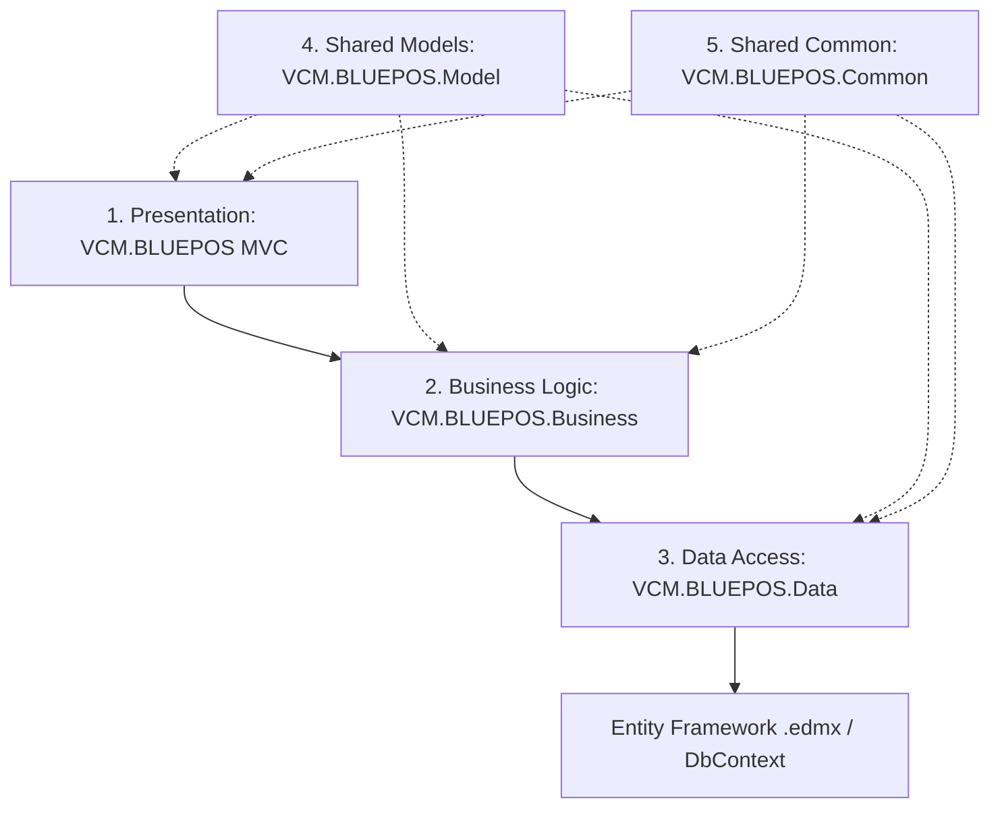
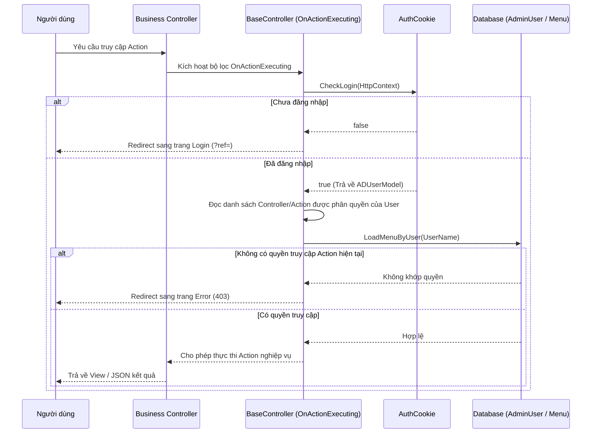

# Hướng Dẫn Phát Triển và Kiến Trúc Dự Án (Portal.RPOS)

Tài liệu này cung cấp cái nhìn tổng quan về kiến trúc dự án, cơ chế hoạt động cốt lõi (xác thực, phân quyền, DI) và hướng dẫn chuẩn từng bước để lập trình viên phát triển tính năng mới trên hệ thống.

---

## 1. Kiến Trúc Hệ Thống (Solution Architecture)

Dự án được xây dựng theo mô hình **Layered Architecture (Kiến trúc phân tầng)** truyền thống trên nền tảng .NET Framework 4.8. Solution `VCM.BLUEPOS.sln` bao gồm 5 project chính:



### Chi tiết vai trò từng Project:

1. **`VCM.BLUEPOS` (Presentation Layer):**
   - Ứng dụng Web ASP.NET MVC 5.2.
   - Chứa các **Controllers**, **Views (cshtml)**, tài nguyên tĩnh (**Content/CSS**, **Scripts/JS**, **Assets**) phục vụ hiển thị và tương tác trực tiếp với người dùng.
   - Chứa file cấu hình khởi chạy chính: `Web.config`, `Global.asax.cs`.
2. **`VCM.BLUEPOS.Business` (Business Logic Layer - BLL/BLO):**
   - Chứa các class xử lý nghiệp vụ chính của hệ thống (Business Logic Objects - BLO).
   - Tiếp nhận dữ liệu từ Controller, xử lý các nghiệp vụ logic (tính toán khuyến mãi, kiểm tra ràng buộc, chuẩn hóa dữ liệu) trước khi đẩy xuống tầng Data Access.
   - Các BLO giao tiếp qua Interface để đảm bảo tính module hóa và dễ viết Unit Test.
3. **`VCM.BLUEPOS.Data` (Data Access Layer - DAL):**
   - Chịu trách nhiệm giao tiếp trực tiếp với các cơ sở dữ liệu.
   - Chứa thư mục `EF/` lưu trữ các Entity Framework Database-First Model (`.edmx` và các thực thể tự động sinh ra trỏ tới các DB MasterData, Sales, Loyalty, v.v.).
   - Thực hiện các câu lệnh LINQ to Entities hoặc SQL thô (`db.Database.SqlQuery`) để CRUD dữ liệu.
4. **`VCM.BLUEPOS.Model` (Data Transfer Objects - DTOs):**
   - Định nghĩa các ViewModels, Request/Response DTOs và các Enums được dùng chung xuyên suốt các tầng.
   - Không chứa logic nghiệp vụ, chỉ có các thuộc tính (properties) dữ liệu.
5. **`VCM.BLUEPOS.Common` (Infrastructure & Common Helpers):**
   - Chứa các thư viện tiện ích dùng chung như mã hóa MD5/SHA (`HashMD5.cs`), định dạng dữ liệu (`ConvertData.cs`), log file local (`LogsFile.cs`) và các hằng số (`Constants.cs`).

---

## 2. Dependency Injection (DI) với Autofac

Dự án sử dụng thư viện **Autofac** làm DI Container để quản lý vòng đời và tự động tiêm (inject) các phụ thuộc.

- **Nơi cấu hình:** File [AutofacConfig.cs](file:///d:/Projects/Portal.RPOS/VCM.BLUEPOS/Models/AutofacConfig.cs).
- **Đăng ký Controller:** Tự động đăng ký tất cả Controllers trong Assembly Web:
  ```csharp
  builder.RegisterControllers(typeof(MvcApplication).Assembly);
  ```
- **Đăng ký Service/BLO/Data:** Các Interface và Class cụ thể được đăng ký dưới dạng `InstancePerLifetimeScope` (tương đương với một Request):
  ```csharp
  builder.RegisterType<SetupPromotionBLO>().As<ISetupPromotionBLO>().InstancePerLifetimeScope();
  ```

> [!TIP]
> **Lưu ý khi phát triển:**
> Dù Autofac đã được thiết lập cho hầu hết các class mới, một số code cũ vẫn sử dụng khởi tạo trực tiếp qua từ khóa `new` (ví dụ: `new AccountBLO()`). Khi viết code mới, hãy luôn ưu tiên sử dụng **Constructor Injection** để tăng tính tùy biến và tuân thủ nguyên tắc SOLID.
>
> *Ví dụ Constructor chuẩn:*
> ```csharp
> private readonly ISetupPromotionBLO _setupBLO;
> public SetupPromotionController(ISetupPromotionBLO setupBLO) {
>     _setupBLO = setupBLO;
> }
> ```

---

## 3. Cơ Chế Xác Thực & Phân Quyền (Authentication & Authorization)

Hệ thống quản lý truy cập chặt chẽ thông qua lớp cha [BaseController.cs](file:///d:/Projects/Portal.RPOS/VCM.BLUEPOS/Controllers/BaseController.cs). Mọi Controller nghiệp vụ đều phải kế thừa `BaseController`.



### Các thuộc tính phân quyền cần chú ý trên Action/Controller:
- **`[DisplayName("Tên chức năng")]`**: Thuộc tính của ASP.NET dùng để hiển thị tên thân thiện của chức năng trên cây menu và phục vụ quét phân quyền.
- **`[ParentAuthorize(Parents = new string[] { "Tên Controller Cha" })]`**: Thuộc tính tùy biến dùng để xác định các action kế thừa quyền từ một controller/action cha.

---

## 4. Hướng Dẫn Từng Bước Tạo Một Chức Năng Mới (Step-by-Step Guide)

Dưới đây là quy trình chuẩn để phát triển một tính năng mới (ví dụ: Thêm tính năng quản lý danh mục đối tác - `SetupPartner`).

### Bước 1: Khai báo Model / DTO
Trong project **`VCM.BLUEPOS.Model`**, tạo thư mục `SetupPartner/` và thêm các model dữ liệu cần thiết:
```csharp
// File: VCM.BLUEPOS.Model/SetupPartner/PartnerRequestModel.cs
namespace VCM.BLUEPOS.Model.SetupPartner {
    public class PartnerRequestModel {
        public string PartnerCode { get; set; }
        public string PartnerName { get; set; }
    }
}
```

### Bước 2: Tạo Lớp Thực Thể Cơ Sở Dữ Liệu (EF Entities)
Nếu cần giao tiếp với cơ sở dữ liệu có sẵn:
1. Mở file `.edmx` tương ứng trong project **`VCM.BLUEPOS.Data/EF/Central/`** (ví dụ `CentralMDPartner.edmx`).
2. Nhấp chuột phải vào màn hình thiết kế, chọn **Update Model from Database...**.
3. Chọn bảng cần thiết, nhấn **Finish** và lưu lại để Entity Framework tự động sinh các class C# tương ứng.

### Bước 3: Tạo Tầng Truy Cập Dữ Liệu (Data Layer)
Trong project **`VCM.BLUEPOS.Data`**, tạo thư mục `SetupPartner/`:
1. Tạo Interface `ISetupPartnerData.cs`.
2. Tạo Class `SetupPartnerData.cs` thực thi interface này:
```csharp
namespace VCM.BLUEPOS.Data.SetupPartner {
    public interface ISetupPartnerData {
        List<PartnerRequestModel> GetListPartner();
    }
    public class SetupPartnerData : ISetupPartnerData {
        public List<PartnerRequestModel> GetListPartner() {
            using (var db = new CentralMDPartnerContainer()) {
                return db.Partners.Select(p => new PartnerRequestModel {
                    PartnerCode = p.Code,
                    PartnerName = p.Name
                }).ToList();
            }
        }
    }
}
```

### Bước 4: Tạo Tầng Nghiệp Vụ (Business Logic Layer - BLO)
Trong project **`VCM.BLUEPOS.Business`**, tạo thư mục `SetupPartner/`:
1. Tạo Interface `ISetupPartnerBLO.cs`.
2. Tạo Class `SetupPartnerBLO.cs` thực thi interface:
```csharp
using VCM.BLUEPOS.Data.SetupPartner;
namespace VCM.BLUEPOS.Business.SetupPartner {
    public interface ISetupPartnerBLO {
        List<PartnerRequestModel> GetListPartner();
    }
    public class SetupPartnerBLO : ISetupPartnerBLO {
        private readonly ISetupPartnerData _partnerData;
        public SetupPartnerBLO(ISetupPartnerData partnerData) {
            _partnerData = partnerData; // Constructor Injection
        }
        public List<PartnerRequestModel> GetListPartner() {
            // Thực hiện thêm các logic kiểm tra quyền, validate nghiệp vụ ở đây...
            return _partnerData.GetListPartner();
        }
    }
}
```

### Bước 5: Đăng Ký Dependency Injection
Mở file [AutofacConfig.cs](file:///d:/Projects/Portal.RPOS/VCM.BLUEPOS/Models/AutofacConfig.cs) và đăng ký các lớp vừa tạo vào container:
```csharp
// Đăng ký Data layer
builder.RegisterType<SetupPartnerData>().As<ISetupPartnerData>().InstancePerLifetimeScope();
// Đăng ký Business layer
builder.RegisterType<SetupPartnerBLO>().As<ISetupPartnerBLO>().InstancePerLifetimeScope();
```

### Bước 6: Tạo Controller
Trong project **`VCM.BLUEPOS/Controllers/`**, tạo file `SetupPartnerController.cs` kế thừa từ `BaseController`:
```csharp
using VCM.BLUEPOS.Business.SetupPartner;
using System.Web.Mvc;
using System.ComponentModel;

namespace PLG.Controllers {
    public class SetupPartnerController : BaseController {
        private readonly ISetupPartnerBLO _partnerBLO;
        
        public SetupPartnerController(ISetupPartnerBLO partnerBLO) {
            _partnerBLO = partnerBLO;
        }

        [DisplayName("Quản lý danh mục đối tác")]
        public ActionResult Index() {
            var data = _partnerBLO.GetListPartner();
            return View(data);
        }
    }
}
```

### Bước 7: Tạo Giao Diện (View) và Viết Scripts
1. Tạo thư mục `Views/SetupPartner/` trong project web.
2. Thêm file view `Index.cshtml`. Sử dụng layout chung của hệ thống:
   ```cshtml
   @model List<VCM.BLUEPOS.Model.SetupPartner.PartnerRequestModel>
   @{
       ViewBag.Title = "Danh mục đối tác";
       Layout = "~/Views/Shared/_Layout.cshtml"; // Sử dụng Layout chung Metronic
   }
   <!-- HTML & Javascript tương tác -->
   ```
3. Tạo file script tương ứng trong thư mục `Content/` (ví dụ `Content/setuppartner.js`) và tham chiếu từ View để thực hiện các cuộc gọi AJAX không đồng bộ đến Controller nếu có.
